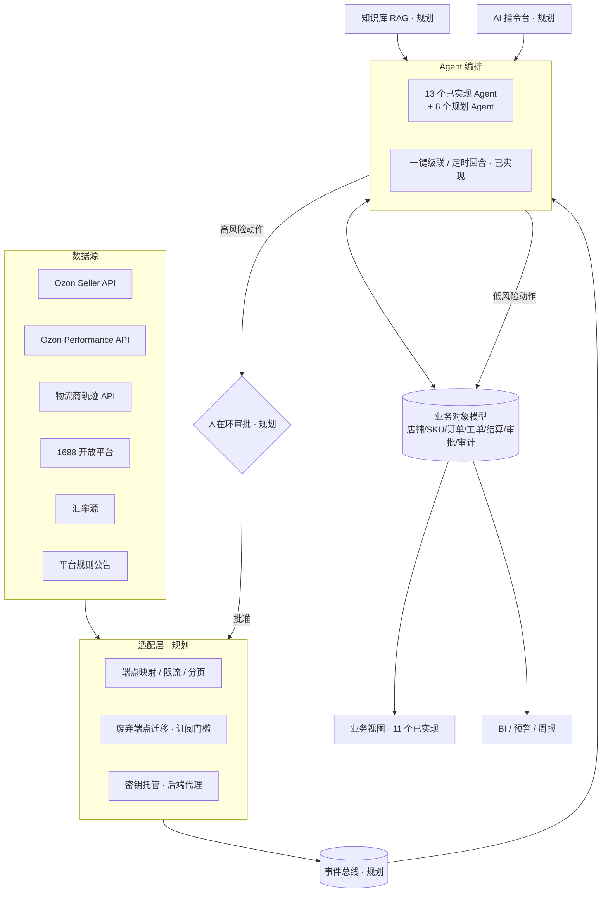

# OzonFlow · AI 原生跨境电商系统架构（Ozon rFBS）

> 目标：让中国 rFBS 卖家用「Agent + 人在环审批」跑通 选品 → 刊登 → 履约 → 客服 → 对账 全链路。
> 本文区分 **已实现**（当前 SPA 中真实存在）与 **规划**（尚未实现）。需求编号见 [REQUIREMENTS_MAP.md](REQUIREMENTS_MAP.md)。

## 1. 现状一句话

当前是纯前端 SPA（`index.html` + `js/app.js` + `js/store.js`，数据存浏览器 localStorage），**尚未接入任何真实平台 API**。
已实现 11 个业务视图 + 13 个 Agent + 一键级联/定时回合；审批队列、AI 指令台、店铺健康页、能力矩阵页、API 适配层（`js/adapters/` 目前为空）均为规划。

| 层 | 已实现 | 规划 |
|---|---|---|
| 业务视图 | 工作台、选品、刊登、订单、自动化规则、物流、利润定价、客服/评价、退货、周报、Agent 中心；开店引导、多店分区、四角色（老板/运营/仓管/客服） | 店铺健康、结算对账、促销/广告、竞品监控、商品卡优化、审批队列、AI 指令台、能力矩阵；财务角色 |
| Agent | 13 个（见 §4） | 6 个新增，目标 19 个 |
| 数据 | localStorage 单机状态 + 事件 `emit` | 服务端存储、事件总线、多租户 |
| 平台接入 | 无 | Ozon Seller / Performance API、物流商、1688 |

## 2. 目标分层

1. **数据接入层**：Ozon Seller API（商品/订单/库存/价格/财务/评价/聊天）、Performance API（广告）、物流商轨迹、1688 开放平台、汇率源、平台规则公告。定时拉取 + Webhook/推送（若平台提供）。
2. **Ozon Seller API 适配层**（`js/adapters/` → 后端服务）：端点映射、限流重试、分页、废弃端点迁移（如 `/v3/finance/transaction/*` 已于 2026-09-08 停用，改 `/v1/finance/accrual/*`，R61）、订阅门槛识别（评价/问答/聊天需 Premium Plus，R62）。浏览器不直接持有密钥，经后端代理（R60）。
3. **事件总线**：`order.created`、`posting.cutoff_near`、`track.stalled`、`review.negative`、`price_index.red`、`fx.changed`、`rule.changed` 等事件驱动 Agent，替代当前前端定时回合。
4. **业务对象模型**：店铺、SKU（成本栈/底价/证书）、订单/Posting、采购单、运单、评价/问答、退货工单、结算行、广告活动、审批单、审计日志。所有 Agent 读写同一对象，避免「各跑各的」。
5. **Agent 编排 + 人在环审批**：编排器按事件/级联顺序调度 Agent；低风险动作（打标签、生成草稿、提醒）自动执行，高风险动作（改价、报名活动、暂停广告、下架、申诉、退款）一律生成审批单，审批后执行并写审计日志（R45、R56）。
6. **知识库 / RAG**：平台规则（佣金、罚则、错误指数分档、禁售清单、EAC/Честный знак 品类）以「来源 + 生效日期」结构化存放；规则变化触发阈值更新与受影响 SKU 重算（R58）。
7. **自然语言指令台**：「把价格指数变红且毛利 >15% 的 SKU 降到建议价」→ 意图解析 → 执行计划预览 → 确认 → 执行或送审批（R55）；Agent 可经 MCP 封装的适配层调用 API（R59）。
8. **BI 与预警**：周报（已实现）、每日简报推送（R48）、店铺健康分区与罚金估算（R49、R50）、回款日历与汇兑损益（R41、R42）。

## 3. 关键设计原则

- **人在环优先**：任何改动店铺对外状态的动作默认送审批，可按角色/金额阈值放宽。
- **利润底价贯穿**：促销、跟卖、调价、广告统一以「目标毛利反推底价」为下限（R05、R22、R24）。
- **规则可追溯**：每个阈值标注来源与日期；规则变更 → 重算 → 通知，而非写死在代码里。
- **可解释**：选品评分、标题评分、风险分都给出分项与权重，不做黑盒（R01、R10）。
- **离线可用、在线增强**：无密钥时用本地状态运行；接入后同一业务对象切换为真实数据源。

## 4. Agent 名册与需求映射

### 已实现（13）

| Agent | id | 覆盖需求 |
|---|---|---|
| 选品雷达 | selection_radar | R01 |
| 刊登过审 | listing_publish | R10（部分）、R15 |
| 审单履约 | order_fulfill | R31（本地状态）、R32 |
| 超时抢救 | timeout_rescue | R29 |
| 1688采购跟单 | purchase_1688 | R07 |
| 物流轨迹异常 | logistics_anomaly | R33 |
| 利润守门 | profit_guard | R05、R09、R20、R22、R24（部分） |
| 汇率佣金重算 | fx_commission | R02（部分）、R21 |
| 俄语客服 | ru_cs | R35 |
| 差评预警升级 | review_escalate | R37（部分） |
| 退货理赔 | return_claim | R38 |
| 库存补货 | inventory_restock | R27 |
| 周报汇报 | weekly_report | R47 |

### 规划（6，目标合计 19）

| Agent | 建议 id | 覆盖需求 |
|---|---|---|
| 跟卖价格监控 | price_monitor | R04、R05、R06 |
| 商品卡优化 | content_optimizer | R10、R11、R12、R13、R14 |
| 合规检查 | compliance_check | R16、R17、R18、R19、R34 |
| 店铺健康 | shop_health | R46、R49、R50、R54 |
| 促销守门 | promo_guard | R24、R25、R26 |
| 结算对账 | finance_recon | R40、R41、R42 |

平台能力（非 Agent，规划）：审批队列 R56、审计日志 R45、AI 指令台 R55、知识库 R58、MCP 工具化 R59、适配层 R60–R62。

## 5. 路线图

| 阶段 | 目标 | 交付 |
|---|---|---|
| **现在**（单机 SPA） | 把高频痛点跑顺 | 11 视图 + 13 Agent + 级联/定时回合（已实现）；下一步：审批队列 + 审计日志（R56/R45）、店铺健康页（R49/R50）、合规检查（R16/R18）、结算对账页（R40）、AI 指令台规则版（R55） |
| **接真实 API**（单店 → 多店） | 用真实数据跑同一流程 | 后端代理 + 密钥托管；适配层接订单/Posting、库存、价格、商品属性、新财务接口、评价/聊天；事件总线替代前端定时；运单号回传（R31）；物流商轨迹；1688 下单 |
| **公司化 SaaS** | 多租户、可计费、可审计 | 租户隔离与 RBAC（含财务角色 R44）、审批流配置、规则知识库 RAG、MCP 工具化、IM/邮件日报推送、SLA 监控与告警、按店铺/Agent 调用量计费 |

## 6. 接入真实数据需要的凭据与授权

| 对象 | 需要什么 | 用途 | 备注 |
|---|---|---|---|
| Ozon Seller API | 每个店铺的 **Client-Id + Api-Key**（卖家后台生成，按权限范围授权） | 商品、订单/Posting、库存、价格、财务、评价、聊天 | 评价/问答/聊天接口需 Premium Plus 等订阅；密钥只存后端 |
| Ozon Performance API | 广告账户 **client_id + client_secret**（OAuth） | 广告花费、ДРР、暂停活动 | CPC 无 SKU 级明细，需自建归因 |
| 物流商 | 各物流商（云途、燕文、4PX、CNE 等）API 账号/Token；Ozon OGL 走 Seller API | 面单、轨迹、运价 | 各家格式不同，需逐家适配 |
| 1688 开放平台 | AppKey/AppSecret + 买家账号 OAuth 授权 | 下单、采购价、物流单号、图搜 | 需企业开发者资质 |
| 汇率源 | 公开汇率 API（或银行牌价） | 汇率佣金重算、汇兑损益 | 无需店铺凭据 |
| 通知渠道 | 企业微信/钉钉/飞书机器人或 SMTP | 日报、预警推送 | 用户显式授权后才发送 |

当前 SPA 不收集、不保存上述任何凭据。

## 7. 风险与边界

- 平台规则变化快（2026-07 realFBS 佣金改类目固定费率、2026-09-22 错误指数重置与新罚金分档、跨境 VAT 法案），所有阈值需带日期并可一键更新。
- 自动化动作必须可回滚、可审计；未经审批不得对外改价/下架/退款/发消息。
- 公开资料（服务商博客、社区 SDK）仅作需求证据，接入时以 Ozon 官方文档为准。
