# 产品需求文档（PRD）

| 项 | 内容 |
|---|---|
| 产品 | OzonFlow · Ozon rFBS 跨境直发经营操作系统 |
| 版本 | v1.0（已上线的 Web 版 + 浏览器连接器扩展 v1.0.0） |
| 线上地址 | https://rong001.github.io/ozonflow-rfbs-app/ |
| 代码仓库 | rong001/ozonflow-rfbs-app |
| 文档范围 | 已上线功能 + 需要 Api-Key / 第三方接口的 9 项规划能力 |

# 1. 背景

Ozon 是俄罗斯第一大电商平台。中国卖家多以 **rFBS（Realistic FBS，卖家自发货跨境直发）** 模式经营：买家下单后，卖家需在截单时效内完成审单、1688 采购、打包、申请面单、交给跨境物流并回传运单号。这条链路跨越 Ozon 卖家后台、1688、物流商系统、Excel 利润表和多个聊天工具，信息分散、全靠人盯。

2025–2026 年平台规则持续收紧：错误指数自 2026-09-22 起重新计算并分档罚款；财务旧接口 2026-09-08 停用；评价 / 问答 / 聊天接口需要 Premium Plus 订阅；同一执照最多开 6 家店。卖家需要一套以 **履约时效、利润、店铺健康** 为核心、能被团队分工使用、且高风险动作可控的经营系统。

# 2. 用户与角色

## 2.1 目标用户

| 用户类型 | 画像 | 对应经营场景（业务数据集） |
|---|---|---|
| 新手卖家 | 刚开店，1 家店、几个 SKU，不懂 rFBS 流程 | 小白冷启动（义乌） |
| 成长期卖家 | 1–2 家店，日单几十到上百，旺季超时多 | 旺季履约突击（广州，默认） |
| 公司化团队 | 3 家以上店铺，老板 / 运营 / 仓管 / 客服 / 财务分工 | 多店公司化 |

## 2.2 角色

| 角色 | 职责 | 可见页面数 |
|---|---|---|
| 老板 | 全局经营、审批高风险动作 | 26 |
| 运营 | 选品、刊登、定价、推广、订单与规则 | 24 |
| 仓管 | 订单履约、物流、库存、退货 | 9 |
| 客服 | 评价、问答、聊天、退货 | 7 |
| 财务 | 利润、对账、回款、健康、审批查看 | 12 |

# 3. 痛点

1. **时效焦虑**：rFBS 截单时效短，休息日、缺货、面单没取都会导致逾期，直接推高错误指数与罚款。
2. **利润算不清**：佣金阶梯、汇率、头程、退货拨备、广告、VAT 叠加，跟卖与活动价常常亏本而不自知。
3. **工具割裂**：卖家后台、1688、物流商、Excel、聊天工具来回切换，团队协作靠截图和口头。
4. **俄语客服门槛**：差评、问答、聊天需俄语回复，响应慢导致评分下降。
5. **对账黑盒**：结算单罚款、物流费差异、汇兑损益难以逐单核对。
6. **API 门槛**：Api-Key 申请、Premium Plus 订阅、接口频繁废弃迁移，小卖家难以接入。
7. **自动化不可控**：直接让脚本改价、退款、采购风险高，缺少审批与审计。

# 4. 产品目标与指标

| 目标 | 指标 | 目标值 |
|---|---|---|
| 降低逾期 | rFBS 逾期发货率 | < 平台阈值，超时风险订单当日清零 |
| 控制罚款 | 错误指数 | ≤ 5%（正常档） |
| 守住利润 | 低于利润底价（净利率 20%）上架或调价的 SKU 数 | 0（全部被拦截或送审） |
| 提效 | 订单审单 + 物流匹配 + 取号自动化率 | ≥ 80% 订单由规则 / Agent 完成 |
| 客服响应 | 差评、问答 24 小时内回复率 | ≥ 95% |
| 对账 | 结算差异单定位时间 | 由逐单人工核对降到分钟级 |
| 可控 | 高风险动作经审批比例 | 100%，且全部留审计日志 |
| 上手 | 新手完成开店向导的时间 | ≤ 5 分钟 |

# 5. 范围

## 5.1 已上线（v1.0）

- 26 个页面：经营总览、AI 指令台、审批中心、经营周报、订单履约、时效物流、物流与库存、供应链库存、自动化规则、智能选品、市场选品、刊登上架、素材工坊、内容合规、价格竞争、推广活动、客服评价、客服收件箱、退货异常、利润定价、财务对账、店铺健康、自动化 Agent、数据连接、平台集成、能力矩阵。
- 13 个垂直 Agent（「旺季履约突击」「多店公司化」默认启用 9 个），一键级联运行。
- 5 角色权限、多店分区、审批中心 + 审计日志。
- 免 Api-Key 数据接入：浏览器连接器扩展（读取已登录的卖家后台）、卖家后台报表导入（CSV / XLSX）、同款公开价格采集（Ozon / WB）、菜鸟物流轨迹公开查询、以图搜货跳转、群机器人简报推送。
- 浏览器内语义模型的中文指令解析；素材工坊本地生成主图 / 视频 / 富内容 JSON。
- 本地 MCP 服务（`server/mcp-ozonflow.js`，8 个只读 / 建议类工具）与经营数据 JSON 导出。
- 需求地图 62 条（22 个方向）全部为已上线状态。

## 5.2 需要 Api-Key 或第三方接口的 9 项（规划）

> 说明：代码中没有单独的「9 项」清单，以下由适配层 `js/adapters/ozon-seller-api.js` 和 `AI_ARCHITECTURE.md` 中需要密钥的写操作整理。适配层已映射端点，代理 `server/ozon-proxy.js` 已就绪，填入密钥并放开 `WRITE_ALLOW` 后即可启用。当前这些动作在系统内完成计算 / 审批后，**需要在 Ozon 卖家后台或第三方平台人工完成**。

| # | 能力 | 接口 | 授权要求 | 当前人工替代 |
|---|---|---|---|---|
| 1 | 发货回写 | `POST /v4/posting/fbs/ship` | Ozon Api-Key | 卖家后台点「发货」 |
| 2 | 运单号回传 | `POST /v2/fbs/posting/tracking-number/set` | Ozon Api-Key | 卖家后台填写运单号 |
| 3 | 面单 PDF | `POST /v2/posting/fbs/package-label` | Ozon Api-Key | 卖家后台下载面单 |
| 4 | 改价回写 | `POST /v1/product/import/prices` | Ozon Api-Key（审批后执行） | 卖家后台改价 |
| 5 | 商品发布 | `POST /v3/product/import`（含类目属性 `/v1/description-category/attribute`） | Ozon Api-Key | 卖家后台上架 |
| 6 | 库存回写 | `POST /v2/products/stocks` | Ozon Api-Key | 卖家后台改库存 |
| 7 | 评价 / 问答 / 聊天回复 | `/v1/review/comment/create`、`/v1/question/answer/create`、`/v1/chat/send/message` | Api-Key + Premium Plus 订阅 | 复制俄语模板到后台发送 |
| 8 | 广告数据与暂停 | Ozon Performance API | client_id + client_secret（OAuth） | 广告后台手动暂停 |
| 9 | 1688 下单与采购价同步 | 1688 开放平台 | 1688 应用授权 | 1688 手动下单、拍立淘搜同款 |

其他候选：物流商面单 / 轨迹 API（云途、燕文等，需物流商账号）；活动报名 `/v1/actions/products/activate`；新财务接口 `/v1/finance/accrual/*` 自动拉取。

## 5.3 不在范围

- 代替卖家登录 Ozon 或存储卖家后台密码；
- 自动绕过平台订阅门槛；
- 无审批的高风险写操作。

# 6. 信息架构

## 6.1 导航结构

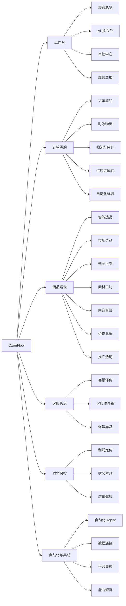
```mermaid
graph LR
  A[OzonFlow] --> W[工作台]
  A --> F[订单履约]
  A --> G[商品增长]
  A --> S[客服售后]
  A --> R[财务风控]
  A --> X[自动化与集成]
  W --> W1[经营总览] & W2[AI 指令台] & W3[审批中心] & W4[经营周报]
  F --> F1[订单履约] & F2[时效物流] & F3[物流与库存] & F4[供应链库存] & F5[自动化规则]
  G --> G1[智能选品] & G2[市场选品] & G3[刊登上架] & G4[素材工坊] & G5[内容合规] & G6[价格竞争] & G7[推广活动]
  S --> S1[客服评价] & S2[客服收件箱] & S3[退货异常]
  R --> R1[利润定价] & R2[财务对账] & R3[店铺健康]
  X --> X1[自动化 Agent] & X2[数据连接] & X3[平台集成] & X4[能力矩阵]
```

## 6.2 全局框架

- 顶栏：命令面板（Ctrl/⌘K）、经营场景、店铺、角色、同步状态、通知、使用手册、重置。
- 侧栏：6 分组，悬停展开 / 固定，分组角标 = 组内待办合计；订单、客服、退货有三级菜单。
- 浮层：开店向导、订单详情抽屉、命令面板、提示消息。

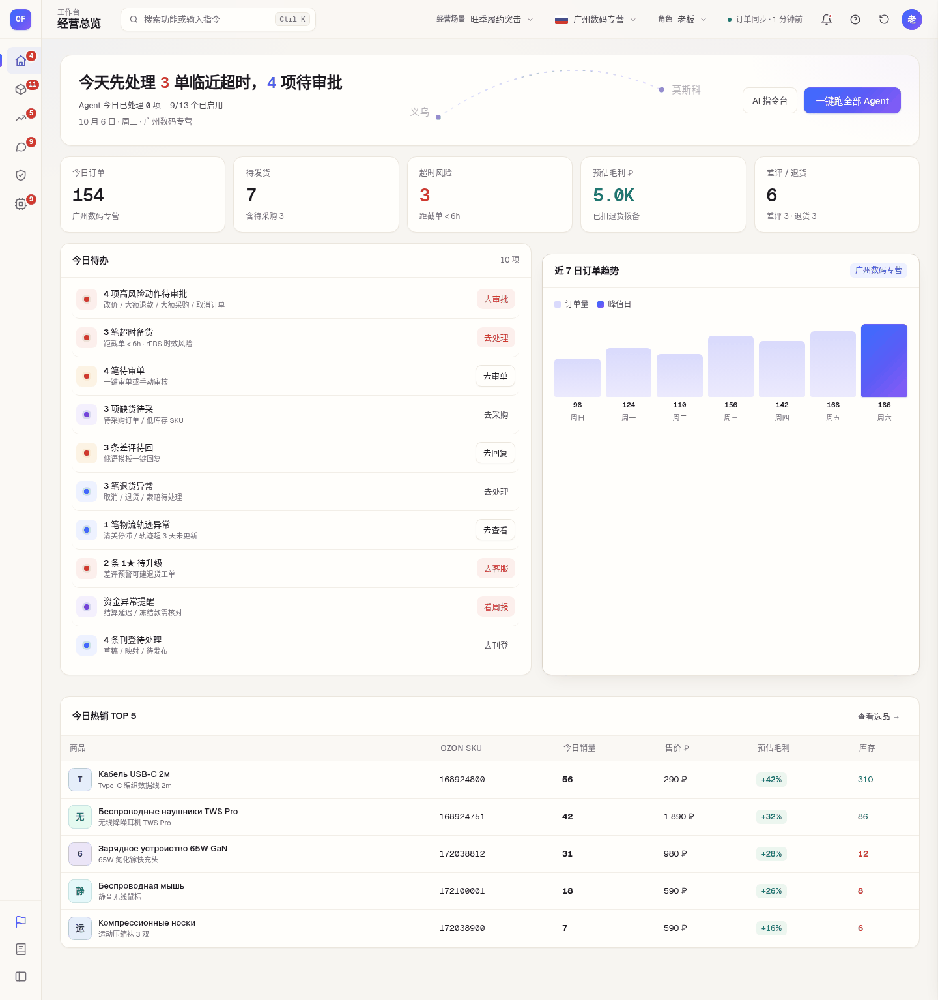

# 7. 功能需求（按模块）

> 每个模块包含：用户故事、功能、业务规则、验收标准。

## 7.1 工作台

**用户故事**

- 作为老板，我打开系统就能看到今天最该先做的事，按风险排好序。
- 作为老板，我用一句中文就能批量处理（如「处理所有超时订单」），并先看到影响范围。
- 作为老板，所有高风险动作都要经我审批，可追溯。

**功能**：经营总览（5 KPI、今日待办、7 日趋势、热销 TOP5、一键跑全部 Agent）；AI 指令台（22 条示例、执行计划预览、确认执行）；审批中心（待审批 / 已处理、批量通过、审计日志）；经营周报（分店铺 / SKU 汇总、导出）。

**业务规则**

- 待办排序：高风险审批 > 超时 > 待审单 > 缺货 > 差评 > 退货 > 轨迹异常 > 资金 > 刊登。
- 审批阈值：改价 > 10%、退款 ≥ 2000₽、采购 ≥ ¥1000、取消订单、暂停广告、低于底价报名活动、申诉、侵权投诉。
- 仅老板可通过 / 驳回；其他角色按钮置灰并提示。
- AI 指令台非只读指令写入审计日志。

**验收标准**

- 总览 KPI 与订单页筛选数一致；待办按钮跳转到对应页面与筛选签。
- 输入「把毛利低于 20% 的商品提价 8%」出现执行计划，确认后生成改价或审批项。
- 审批通过后状态变为已处理，审计日志新增一条。

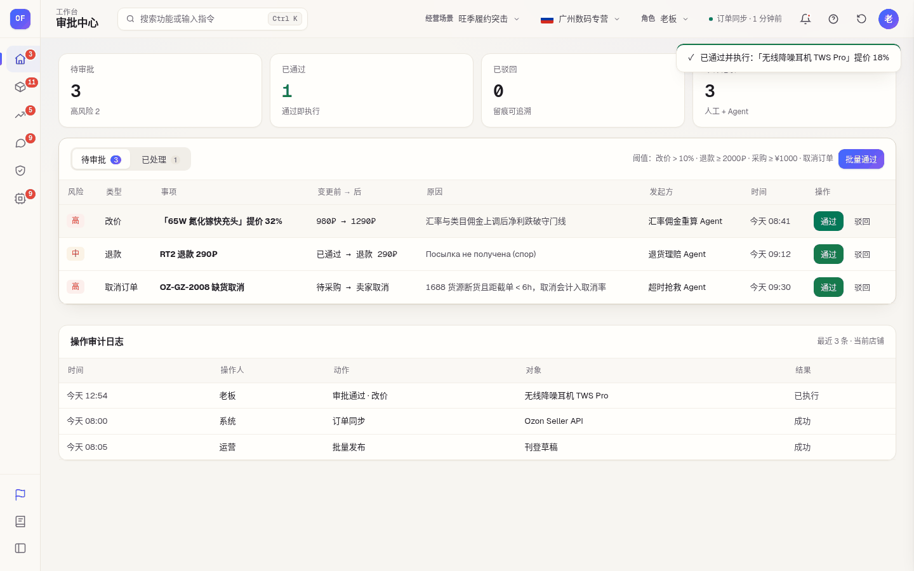

## 7.2 订单履约

**用户故事**

- 作为仓管，我希望订单自动审单、匹配物流、取号，我只负责打包发货。
- 作为运营，我要第一时间看到 6 小时内要超时的订单。
- 作为仓管，休息日前要知道哪些单必须提前发。

**功能**：订单 6 状态筛选 + 搜索；一键审单；批量申请面单；订单抽屉与自动化时间线；6 条 IF / THEN 规则；休息日截单影响；运单号回传；渠道运价比较；报关一致性；IML 退货处置；物流渠道；库存同步与补货；多店共享库存防超卖；rFBS / FBO / FBP 决策；海外仓补货与滞销。

**业务规则**

- 自动审单：金额 < 5000₽ 且无买家留言。
- 物流匹配：≤ 500g 云途俄线，> 500g 燕文经济。
- 审单后本地库存不足 → 待采购；采购完成 → 待发货。
- 超时风险：剩余时效 ≤ 6h 且未发货。
- 运费 = 单价 × 重量 + 挂号费 ¥12；报关申报价按订单价 80% 校准。
- 共享库存按近 7 天销量比例分配，预留 10%。
- 补货单金额 ≥ ¥1000 进审批。

**验收标准**

- 「一键审单」后符合规则的订单进入待发货并带「已审单」「已匹配物流」标签。
- 「批量申请面单」后订单生成运单号与「已取号」标签。
- 「发货」后状态为已发货，总览待发货数同步减少。
- 发货 / 运单号回传在接入 Api-Key 前明确提示需在卖家后台完成。

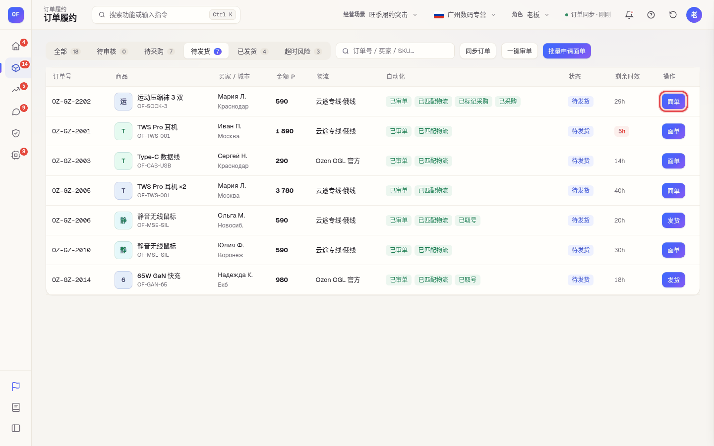

## 7.3 商品增长

**用户故事**

- 作为运营，我要知道哪个品值得做，上架前就算清利润。
- 作为运营，刊登前自动检查属性、证书、禁限售词和图片规范。
- 作为运营，跟卖压价时不能跌破底价，大幅调价要老板批。

**功能**：智能选品（爆款 / 蓝海 / 跟卖、利润测算、认领）；市场选品（5 维评分、节点倒推、断货换供）；刊登上架（草稿 → 映射 → 待发布 → 已发布）；素材工坊（白底主图、视频、富内容 JSON）；内容合规（内容评分、标题公式、EAC、Честный знак、禁限售词、图片规范、问答回写、防盗图）；价格竞争（价格指数、跟卖、底价、比价、成本栈、VAT、佣金重排）；推广活动（ДРР / ROI、亏损暂停、预算分配、活动利润）。

**业务规则**

- 选品评分权重：销量 25 · 净利率 30 · 重量 10 · 竞争度 15 · 趋势 20；红线品直接 0 分。
- 备货截止 = 节点日期 − 26 天。
- 内容评分：俄语标题 25、类目属性 25、图片 20、富文本 10、视频 10、合规 10。
- 证书到期前 60 天提醒；缺失或过期的商品被刊登 Agent 拦截。
- 图片：≥ 5 张、主图白底、无中文与水印、边长 ≥ 900px。
- 价格指数偏红 = 比全网最低高 10% 以上；建议价不低于底价（净利率 20%）。
- 整体 ДРР 目标 ≤ 15%；亏损广告暂停需审批；低于底价的活动报名需审批。

**验收标准**

- 选品「测算利润」后右侧显示净利与利润率；「认领」后进入刊登草稿并跳转。
- 刊登「批量发布待发布」后状态为已发布。
- 价格竞争「按建议调价」幅度 > 10% 时生成审批项，否则直接生效。

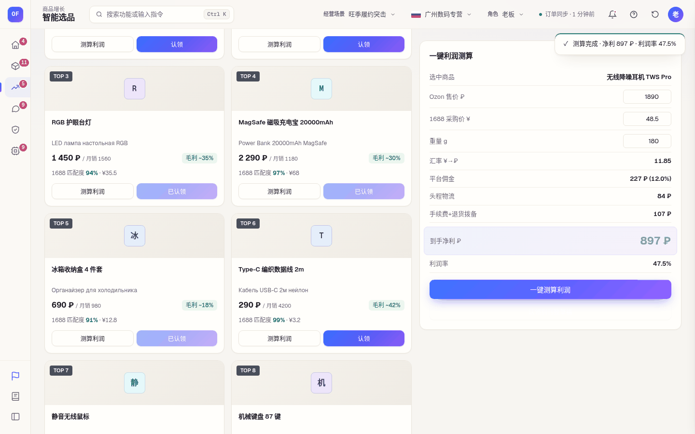

## 7.4 客服售后

**用户故事**

- 作为客服，我不会俄语也能用模板快速回复差评和问答。
- 作为客服，多家店的买家消息要在一个地方回。
- 作为老板，大额退款要我批。

**功能**：评价 / 问答 / 俄语模板（5 类）；多店聊天聚合与意图建议回复；差评根因聚类回流；退货状态机（待处理 → 调查中 / 已同意 / 已拒绝 → 已退款 → 已关闭）。

**业务规则**：≤ 3 星为差评；1 星差评升级为理赔工单；退款 ≥ 2000₽ 进审批；回复发送需 Premium Plus（未开通时复制到后台）。

**验收标准**：「模板回复」后评价显示回复内容、待回数减少；退款 ≥ 2000₽ 时出现在审批中心。

## 7.5 财务风控

**用户故事**

- 作为财务，我要逐单看结算和预期利润的差异，找出罚款和多扣的物流费。
- 作为老板，我要知道错误指数离下一档还差多少、要罚多少钱。

**功能**：共享费率与三情景测算；逐单对账、申诉、回款日历、汇兑损益、合规清单；服务质量指标、错误指数分档与罚金、风险分、临期抢救、多账号、商品卡合并违规。

**业务规则**

- 佣金阶梯：≤ 500₽ 15%，500–2000₽ 12%，> 2000₽ 10%。
- 跟卖价 = 售价 × 95%，活动价 = 售价 × 90%。
- 头程运费 = max(80, 重量 kg × 头程 ¥/kg × 汇率 + 45) ₽。
- 对账差异：实际净利偏离预期超过 30₽。
- 回款：每月 15 日与月末两次估算。
- 错误指数：≤ 5% 正常，5.1–10% 一档，> 10% 二档。
- 风险分权重：取消率 30、逾期 25、错误指数 20、差评 15、退货 10；≥ 60 时申诉 / 下架 / 批量改价强制审批。

**验收标准**：修改费率保存后，选品、价格竞争、利润定价净利同步更新；对账「发起申诉」生成审批项。

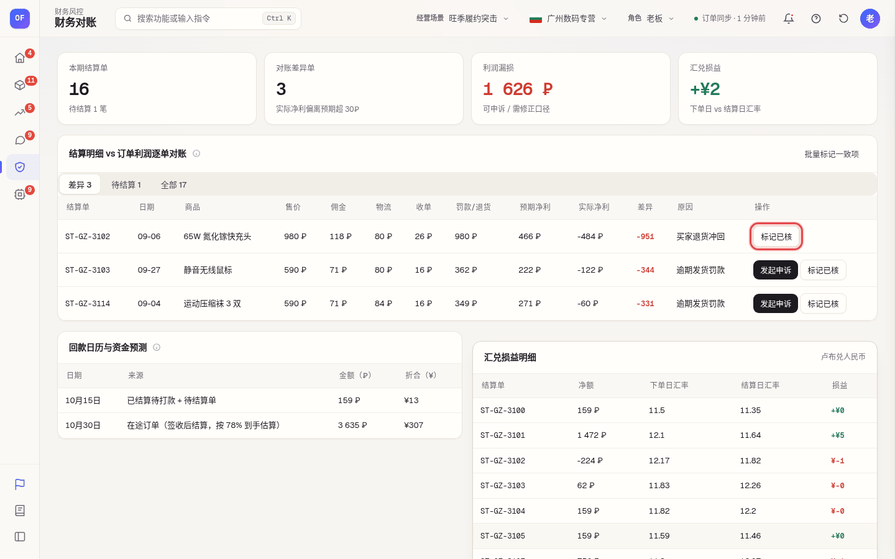

## 7.6 自动化与集成

**用户故事**

- 作为老板，我希望重复劳动交给 Agent，按顺序自动跑完一轮，高风险的留给我批。
- 作为卖家，我没有 Api-Key 也能把真实店铺数据接进来。

**功能**：13 Agent 开关 / 运行 / 定时回合（45 秒）/ 一键级联 / 活动日志；数据连接 7 个入口；Seller API 适配层（17 端点）与代理配置、废弃迁移与订阅门槛监控、规则知识库、MCP 工具清单、每日简报、角色说明；能力矩阵 62 条需求。

**业务规则**

- 一键级联顺序：选品雷达 → 刊登过审 → 利润守门 → 汇率佣金重算 → 1688 采购跟单 → 超时抢救 → 审单履约 → 物流轨迹异常 → 库存补货 → 俄语客服 → 差评预警升级 → 退货理赔 → 周报汇报。
- Agent 产生的高风险动作一律进入审批中心。
- MCP / 适配层工具权限：只读自动执行；写操作记审计；高风险写操作必须审批。
- 连接器只读取用户已登录页面，不保存账号密码。

**验收标准**：「一键跑全部 Agent」后提示处理条数，活动日志合流新增记录；安装扩展后数据连接显示「已连接 v1.0.0」，「从插件同步」后订单数增加。

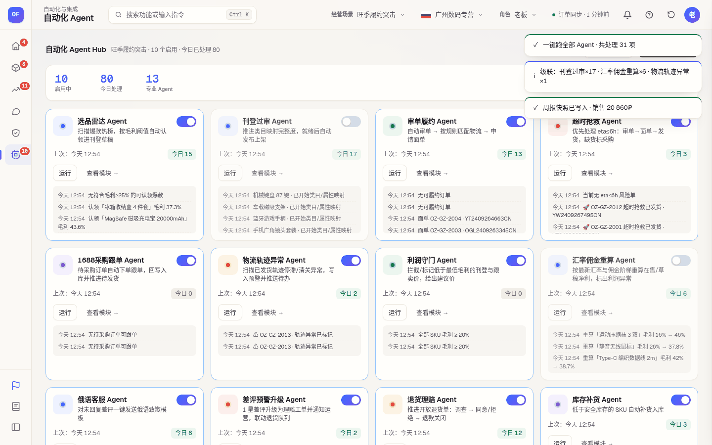

# 8. 关键流程

## 8.1 订单履约

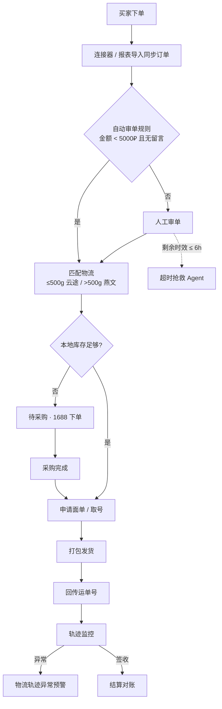
```mermaid
flowchart TD
  A[买家下单] --> B[连接器 / 报表导入同步订单]
  B --> C{自动审单规则<br/>金额 < 5000₽ 且无留言}
  C -- 否 --> C1[人工审单] --> D
  C -- 是 --> D[匹配物流<br/>≤500g 云途 / >500g 燕文]
  D --> E{本地库存足够?}
  E -- 否 --> F[待采购 · 1688 下单] --> G[采购完成]
  E -- 是 --> H[申请面单 / 取号]
  G --> H
  H --> I[打包发货]
  I --> J[回传运单号]
  J --> K[轨迹监控]
  K -- 异常 --> L[物流轨迹异常预警]
  K -- 签收 --> M[结算对账]
  C1 -. 剩余时效 ≤ 6h .-> X[超时抢救 Agent]
```

## 8.2 审批

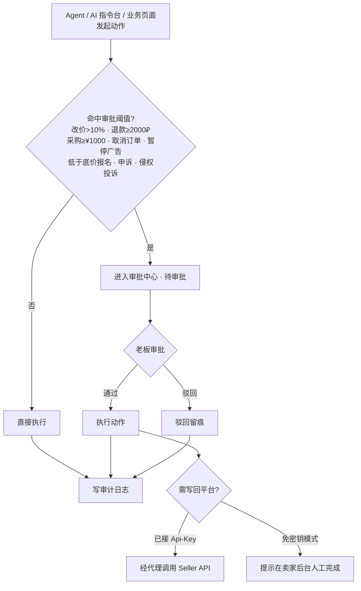
```mermaid
flowchart TD
  A[Agent / AI 指令台 / 业务页面发起动作] --> B{命中审批阈值?<br/>改价>10% · 退款≥2000₽<br/>采购≥¥1000 · 取消订单 · 暂停广告<br/>低于底价报名 · 申诉 · 侵权投诉}
  B -- 否 --> C[直接执行] --> G[写审计日志]
  B -- 是 --> D[进入审批中心 · 待审批]
  D --> E{老板审批}
  E -- 通过 --> F[执行动作] --> G
  E -- 驳回 --> H[驳回留痕] --> G
  F --> I{需写回平台?}
  I -- 已接 Api-Key --> J[经代理调用 Seller API]
  I -- 免密钥模式 --> K[提示在卖家后台人工完成]
```

## 8.3 Agent 编排（一键级联）

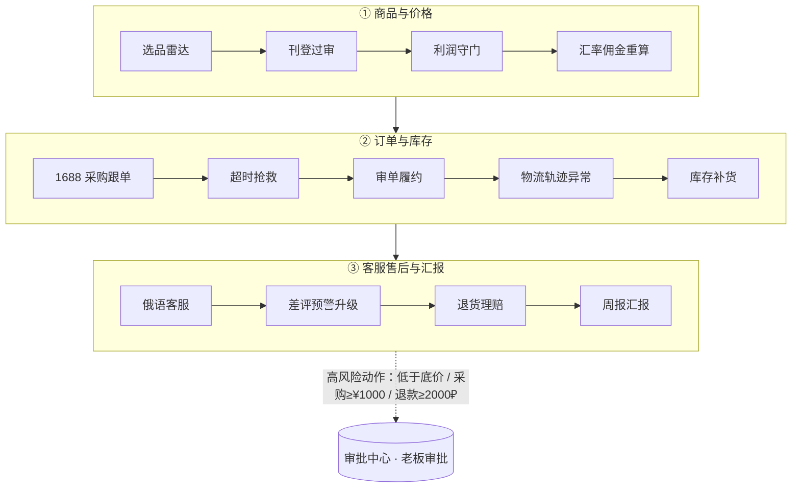
```mermaid
flowchart TB
  subgraph G1[① 商品与价格]
    direction LR
    S1[选品雷达] --> S2[刊登过审] --> S3[利润守门] --> S4[汇率佣金重算]
  end
  subgraph G2[② 订单与库存]
    direction LR
    O1[1688 采购跟单] --> O2[超时抢救] --> O3[审单履约] --> O4[物流轨迹异常] --> O5[库存补货]
  end
  subgraph G3[③ 客服售后与汇报]
    direction LR
    C1[俄语客服] --> C2[差评预警升级] --> C3[退货理赔] --> W[周报汇报]
  end
  G1 --> G2 --> G3
  G3 -. 高风险动作：低于底价 / 采购≥¥1000 / 退款≥2000₽ .-> AP[(审批中心 · 老板审批)]
```

# 9. 权限矩阵

✔ = 可见可操作；◐ = 可见、部分操作受限；— = 不可见。

| 页面 | 老板 | 运营 | 仓管 | 客服 | 财务 |
|---|---|---|---|---|---|
| 经营总览 | ✔ | ✔ | ✔ | ✔ | ✔ |
| AI 指令台 | ✔ | ✔ | ✔ | ✔ | ✔ |
| 审批中心 | ✔（审批） | ◐ 查看 | — | — | ◐ 查看 |
| 经营周报 | ✔ | ✔ | — | — | ✔ |
| 订单履约 | ✔ | ✔ | ✔ | ◐ | — |
| 时效物流 | ✔ | ✔ | ✔ | — | — |
| 物流与库存 | ✔ | ✔ | ✔ | — | — |
| 供应链库存 | ✔ | ✔ | ✔ | — | — |
| 自动化规则 | ✔ | ✔ | — | — | — |
| 智能选品 | ✔ | ✔ | — | — | — |
| 市场选品 | ✔ | ✔ | — | — | — |
| 刊登上架 | ✔ | ✔ | — | — | — |
| 素材工坊 | ✔ | ✔ | — | — | — |
| 内容合规 | ✔ | ✔ | — | — | — |
| 价格竞争 | ✔ | ✔ | — | — | ✔ |
| 推广活动 | ✔ | ✔ | — | — | ✔ |
| 客服评价 | ✔ | ✔ | — | ✔ | — |
| 客服收件箱 | ✔ | ✔ | — | ✔ | — |
| 退货异常 | ✔ | — | ✔ | ✔ | — |
| 利润定价 | ✔ | ✔ | — | — | ✔ |
| 财务对账 | ✔ | — | — | — | ✔ |
| 店铺健康 | ✔ | ✔ | — | — | ✔ |
| 自动化 Agent | ✔ | ✔ | ✔ | ✔ | — |
| 数据连接 | ✔ | ✔ | ✔ | — | ✔ |
| 平台集成 | ✔ | ✔ | — | — | ✔ |
| 能力矩阵 | ✔ | ✔ | — | — | ✔ |
| **合计可见** | **26** | **24** | **9** | **7** | **12** |

> 来源：`js/store.js` 中的 `ROLE_VIEWS`。切换角色后侧栏只显示可见页面；直接访问不可见页面时提示「当前角色无权访问」，当前页面不可见时自动回到经营总览。

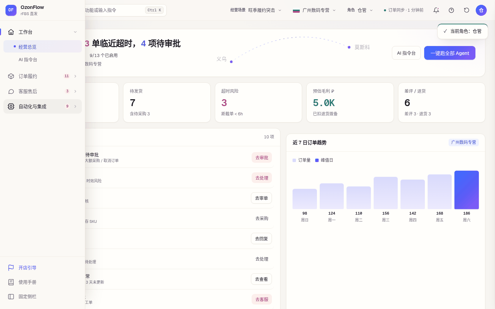

# 10. 非功能需求

| 类别 | 要求 |
|---|---|
| 性能 | 首屏为纯静态 HTML/JS，无构建；页面切换 < 200ms；语义模型首次加载约 24MB，加载前降级为规则解析 |
| 兼容 | 桌面 Chrome / Edge 最新版；1440 宽为基准；移动端 390 宽侧栏收为底部图标栏、表格横向滚动 |
| 安全 | 不保存卖家后台账号密码；Api-Key 只存在代理服务器环境变量（`OZON_CLIENT_ID`、`OZON_API_KEY`），前端不接触；代理默认只读，`WRITE_ALLOW` 显式放开写操作；`ALLOW_ORIGIN` 限制来源 |
| 可控 | 高风险动作 100% 经审批；所有写动作写审计日志（时间、操作人、动作、对象、结果） |
| 数据隔离 | 多店分区，所有列表与 KPI 按当前店铺过滤；状态存于浏览器 localStorage（`ozonflow_rfbs_v2`），可一键重置 |
| 可用性 | 每个 KPI / 卡片有 ⓘ 口径说明；所有操作有即时提示；命令面板全局可达；内置使用手册 |
| 可维护 | 平台规则集中在规则知识库；API 端点集中在适配层，废弃迁移有监控 |

# 11. 数据与集成

## 11.1 免密钥模式（当前）

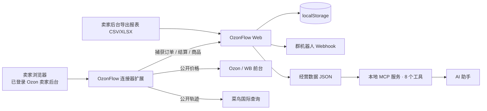
```mermaid
flowchart LR
  U[卖家浏览器<br/>已登录 Ozon 卖家后台] --> EXT[OzonFlow 连接器扩展]
  EXT -- 捕获订单 / 结算 / 商品 --> APP[OzonFlow Web]
  CSV[卖家后台导出报表 CSV/XLSX] --> APP
  EXT -- 公开价格 --> PUB[Ozon / WB 前台]
  EXT -- 公开轨迹 --> CN[菜鸟国际查询]
  APP --> LS[(localStorage)]
  APP --> HOOK[群机器人 Webhook]
  APP --> JSON[经营数据 JSON] --> MCP[本地 MCP 服务 · 8 个工具] --> AI[AI 助手]
```

- 连接器：Chrome 扩展（ID 以安装为准），在用户已登录的卖家后台页面读取接口返回，app 页面经 bridge 获取数据并显示「已连接 v1.0.0」。
- 报表导入：自动识别订单报表与财务报表，记录识别行数。
- MCP：`node server/mcp-ozonflow.js`，工具 ozonflow_summary、list_orders、list_products、shop_health、finance_diffs、compete_prices、daily_brief、propose_price_change；改价建议写入 ozonflow-pending.json，导入后全部进审批。

## 11.2 Api-Key 模式（规划）

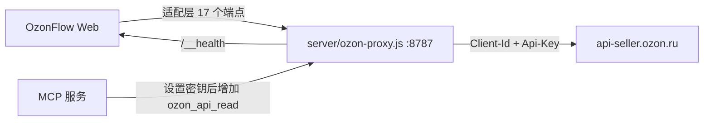
```mermaid
flowchart LR
  APP[OzonFlow Web] -- 适配层 17 个端点 --> PX[server/ozon-proxy.js :8787]
  PX -- Client-Id + Api-Key --> OZ[api-seller.ozon.ru]
  PX -- /__health --> APP
  MCP[MCP 服务] -- 设置密钥后增加 ozon_api_read --> PX
```

- 部署：`OZON_CLIENT_ID=… OZON_API_KEY=… ALLOW_ORIGIN=… PORT=8787 node server/ozon-proxy.js`；平台集成页切换「代理」模式并「测试连接」。
- 写操作白名单 `WRITE_ALLOW`，并叠加审批中心。
- 端点迁移：shipOrder 用 v4；财务改用 `/v1/finance/accrual/*`。

# 12. 版本规划

| 版本 | 时间 | 内容 |
|---|---|---|
| v1.0（当前） | 2026 Q3 | 26 页 + 13 Agent + 5 角色 + 审批 / 审计 + 免密钥连接器 / 报表导入 / 公开数据 + MCP + 使用手册 |
| v1.1 | 2026 Q4 | Api-Key 只读接入：订单、商品、库存、结算自动拉取（代理只读模式），替代手动同步 |
| v1.2 | 2026 Q4 | 写回 1–6：发货、运单号、面单 PDF、改价、发布、库存（审批后执行） |
| v1.3 | 2027 Q1 | 7–8：Premium Plus 评价 / 问答 / 聊天回复，Performance API 广告读取与暂停 |
| v1.4 | 2027 Q1 | 9：1688 开放平台下单与采购价同步；物流商面单 / 轨迹 API；活动报名 |
| v2.0 | 2027 Q2 | 多人账号与云端同步、团队权限后台、跨设备审批 |

# 13. 关键页面截图

| 页面 | 截图 |
|---|---|
| 经营总览 |  |
| 订单履约 | 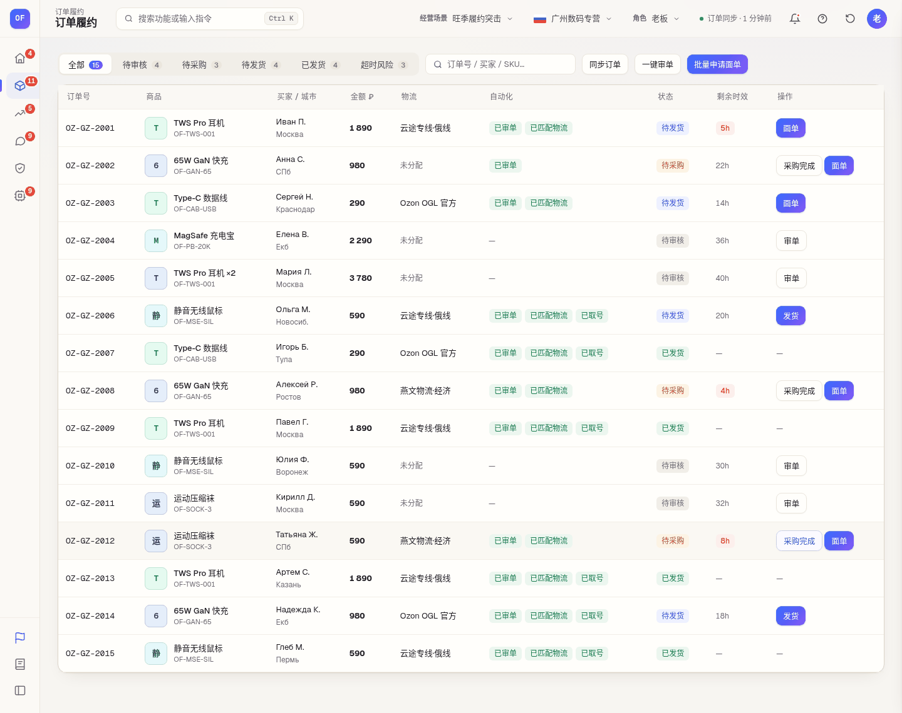 |
| 审批中心 | 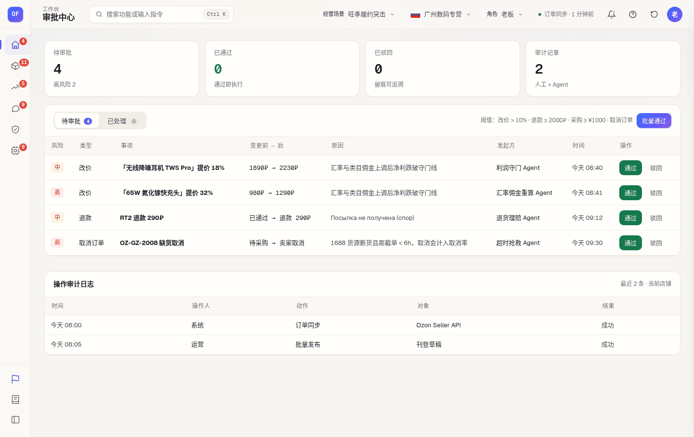 |
| 自动化 Agent | 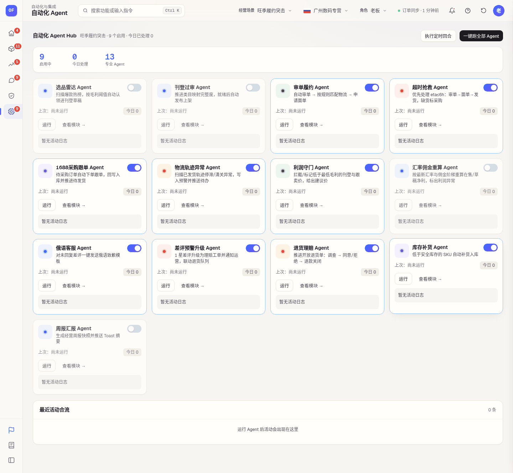 |
| 数据连接（已连接） | 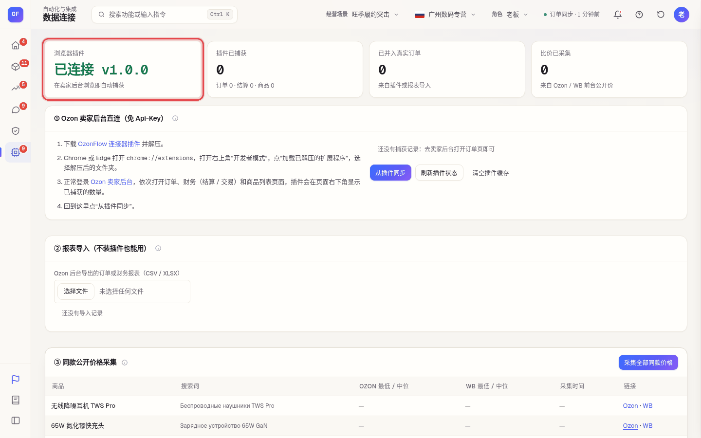 |
| 利润定价 | 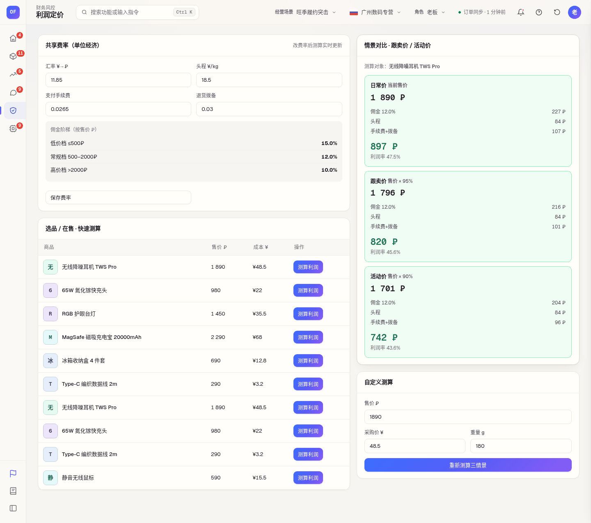 |
| 店铺健康 | 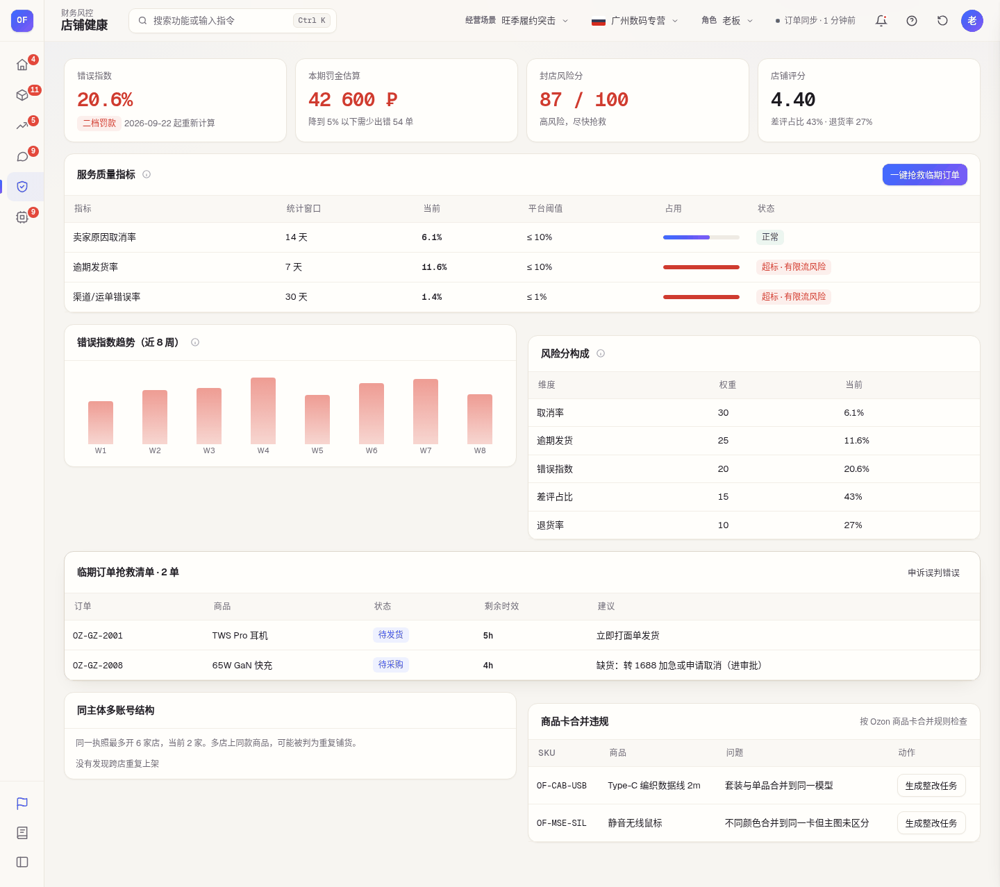 |
| 移动端 | 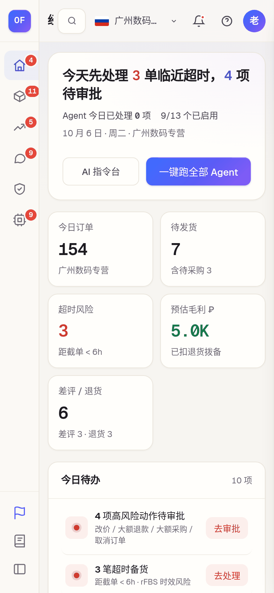 |
