# 页面说明书

本说明书覆盖 OzonFlow 的 **全部 26 个页面**（视图 ID 来自 `index.html` 中 `.nav-item[data-view]`），按侧栏 6 个分组排序。每页包含：截图、页面用途、入口路径、页面区域说明、数据来源、适用角色、关联页面。截图均为 1440 宽整页实拍（「旺季履约突击」经营场景、广州数码专营店、老板角色）。

**数据来源标记说明**

| 标记 | 含义 |
|---|---|
| 【连接器】 | 免密钥模式：OzonFlow 连接器扩展在已登录的卖家后台读取，或卖家后台导出报表导入 |
| 【公开接口】 | 经扩展调用的公开数据：Ozon / WB 前台同款价格、菜鸟国际轨迹查询 |
| 【本地计算】 | 浏览器内根据业务数据集与共享费率计算（利润、风险分、建议等），存于 localStorage |
| 【待接 API】 | 需要 Ozon Seller API Api-Key（经 `server/ozon-proxy.js`）或第三方授权后才能自动读写 |

**全局元素（所有页面通用）**

- **侧栏**：6 个分组（工作台 / 订单履约 / 商品增长 / 客服售后 / 财务风控 / 自动化与集成），悬停展开，可固定；分组图标角标为组内待办合计；底部「开店引导」「使用手册」「固定侧栏」。
- **顶栏**：面包屑 + 页面标题；命令面板入口（Ctrl/⌘K）；经营场景；店铺切换；角色切换；订单同步状态；通知铃铛；使用手册「?」；重置当前场景「↻」；角色头像。
- **提示消息**：每次操作后在右上角显示约 3 秒（✓ 成功 / ℹ 信息）。
- **说明图标 ⓘ**：卡片标题旁的 ⓘ 悬停显示该卡片的口径说明。

| 分组 | 页面（视图 ID） |
|---|---|
| 工作台 | 经营总览 dashboard · AI 指令台 copilot · 审批中心 approvals · 经营周报 weekly |
| 订单履约 | 订单履约 orders · 时效物流 sla · 物流与库存 logistics · 供应链库存 supply · 自动化规则 rules |
| 商品增长 | 智能选品 selection · 市场选品 market · 刊登上架 listing · 素材工坊 studio · 内容合规 content · 价格竞争 compete · 推广活动 promo |
| 客服售后 | 客服评价 cs · 客服收件箱 inbox · 退货异常 returns |
| 财务风控 | 利润定价 profit · 财务对账 finance · 店铺健康 health |
| 自动化与集成 | 自动化 Agent agents · 数据连接 connect · 平台集成 platform · 能力矩阵 capability |

---

# 一、工作台

## 1. 经营总览（dashboard）

- **页面用途**：每天开工的第一屏，汇总当前店铺今日关键数字、按风险排序的待办和趋势。
- **入口路径**：侧栏「工作台 → 经营总览」；打开系统默认进入；命令面板输入「总览」。
- **页面区域说明**
  - **焦点区（Hero）**：日期 · 星期 · 店铺；一句话今日重点（如「今天先处理 3 单临近超时，4 项待审批」）；「Agent 今日已处理 N 项」「N/13 个已启用」；按钮「AI 指令台」（跳转 AI 指令台）、「一键跑全部 Agent」（按级联顺序运行 13 个 Agent，见 agents 页）。
  - **开店进度卡**：仅在开店向导未完成或刚完成时显示，4 项（绑定店铺 / 选择 rFBS / 默认物流 / 导入商品）完成状态与「继续引导」。
  - **KPI 卡（5 张）**：今日订单（当前店铺）；待发货（副标题：含待采购 N）；超时风险（距截单 < 6h，红色）；预估毛利 ₽（已扣退货拨备）；差评 / 退货（差评 N · 退货 N）。
  - **今日待办**：右上角「N 项」。每行：色点（红 = 高风险、橙 = 警示、紫 = 待采、蓝 = 信息）、标题、说明、按钮。条目包括：高风险动作待审批 → 去审批（审批中心）；超时备货 → 去处理（订单 · 超时风险）；待审单 → 去审单（订单 · 待审核）；缺货待采 → 去采购（订单 · 待采购）；差评待回 → 去回复（客服评价）；退货异常 → 去处理（退货 · 待处理）；物流轨迹异常 → 去查看（订单 · 已发货）；1★ 待升级 → 去客服；资金异常提醒 → 看周报；刊登待处理 → 去刊登。
  - **近 7 日订单趋势**：柱状图（订单量 / 峰值日高亮），右上角为当前店铺标签。
  - **今日热销 TOP 5**：列 = 商品（俄文名 + 中文名）/ Ozon SKU / 今日销量 / 售价 ₽ / 预估毛利（%）/ 库存（低库存标红）；「查看选品 →」跳智能选品。
- **数据来源**：订单、商品【连接器】；KPI、毛利、待办排序【本地计算】。
- **适用角色**：老板、运营、仓管、客服、财务。
- **关联页面**：订单履约、审批中心、客服评价、退货异常、刊登上架、智能选品、自动化 Agent、AI 指令台。

## 2. AI 指令台（copilot）

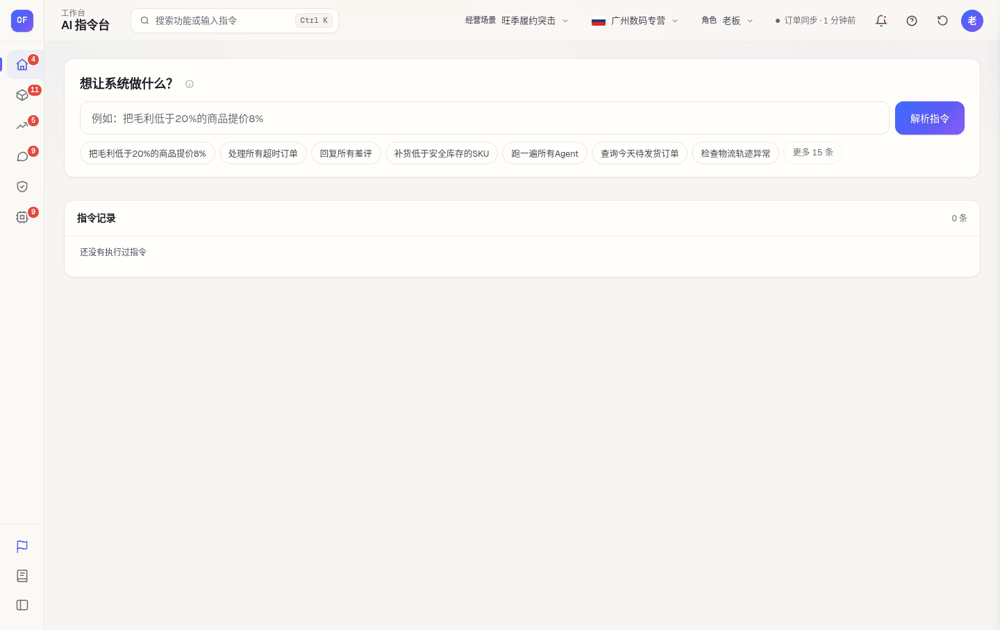

- **页面用途**：用一句中文口语下达经营指令，系统先给出执行计划（影响范围与风险），确认后执行或送审批。
- **入口路径**：侧栏「工作台 → AI 指令台」；经营总览「AI 指令台」按钮；命令面板最后一项「让 AI 执行：…」。
- **页面区域说明**
  - **输入卡「想让系统做什么？」**：ⓘ 说明「先预览影响范围，确认后才执行。改价超 10%、退款 ≥ 2000₽、采购 ≥ ¥1000、取消订单都会进审批中心」；输入框（回车或「解析指令」）；示例标签 7 个 + 「更多 15 条」（共 22 条：把毛利低于 20% 的商品提价 8% / 处理所有超时订单 / 回复所有差评 / 补货低于安全库存的 SKU / 跑一遍所有 Agent / 查询今天待发货订单 / 检查物流轨迹异常 / 生成本周周报 / 切换到深圳配件馆 / 打开审批中心 / 暂停所有亏损广告 / 检查证书到期和风险词 / 对一下本店回款差异 / 看看店铺健康和错误指数 / 回传所有运单号 / 回复买家消息 / 生成今日简报 / 同步店铺数据 / 采集同款价格 / 查物流轨迹 / 推送简报到群 / 库存快没了怎么办）。
  - **执行计划卡**（解析后出现）：识别意图、影响对象数量、风险标签（低风险 / 需审批）、受影响对象明细表（列随意图变化，如 商品 / SKU / 本地库存 / 安全库存）；按钮「确认执行」「取消」。
  - **指令记录**：时间、指令、结果；非只读指令同时写入审计日志。
- **数据来源**：意图解析为规则引擎 + 浏览器内语义模型 bge-small-zh（transformers.js，首次加载约 24MB，无需大模型 Key）【本地计算】；执行动作作用于业务数据【本地计算】，写回平台【待接 API】。
- **适用角色**：老板、运营、仓管、客服、财务（执行受角色权限约束）。
- **关联页面**：审批中心、订单履约、自动化 Agent、命令面板。

## 3. 审批中心（approvals）

- **页面用途**：人在环把关高风险动作，老板通过即执行、驳回留痕，所有动作可审计。
- **入口路径**：侧栏「工作台 → 审批中心」（角标为待审批数）；经营总览待办「去审批」。
- **页面区域说明**
  - **KPI**：待审批（高风险 N）/ 已通过（通过即执行）/ 已驳回（留痕可追溯）/ 审计记录（人工 + Agent）。
  - **审批列表**：页签「待审批 N」「已处理 N」；右侧阈值说明「改价 > 10% · 退款 ≥ 2000₽ · 采购 ≥ ¥1000 · 取消订单」与「批量通过」。列：风险（中 / 高）/ 类型（改价、退款、取消订单、采购、暂停广告、活动报名、申诉、侵权投诉）/ 事项 / 变更前 → 后 / 原因 / 发起方（Agent 或角色）/ 时间 / 操作（通过、驳回）。非老板角色按钮置灰并提示切到老板。
  - **操作审计日志**：最近 N 条 · 当前店铺；列 时间 / 操作人 / 动作 / 对象 / 结果。
- **数据来源**：审批项由 Agent、AI 指令台、各业务页按阈值生成【本地计算】；执行后写回平台【待接 API】。
- **适用角色**：老板（审批）、运营、财务（查看）。
- **关联页面**：价格竞争、推广活动、退货异常、供应链库存、内容合规、店铺健康、自动化 Agent、财务对账。

## 4. 经营周报（weekly）

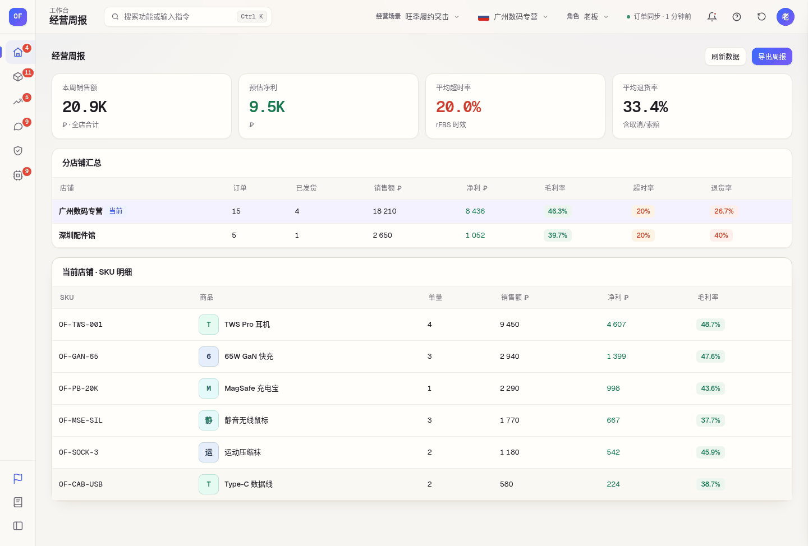

- **页面用途**：按店铺、按 SKU 回顾销售、净利、超时率与退货率。
- **入口路径**：侧栏「工作台 → 经营周报」；总览待办「看周报」。
- **页面区域说明**
  - **操作栏**：「刷新数据」（重新计算并提示生成时间）、「导出周报」（导出当前店铺周报，本地导出提示）。
  - **KPI**：本周销售额（₽ · 全店合计）/ 预估净利 / 平均超时率（rFBS 时效）/ 平均退货率（含取消 / 索赔）。
  - **分店铺汇总**：店铺（当前店标注）/ 订单 / 已发货 / 销售额 ₽ / 净利 ₽ / 毛利率 / 超时率 / 退货率。
  - **当前店铺 · SKU 明细**：SKU / 商品 / 单量 / 销售额 ₽ / 净利 ₽ / 毛利率。
- **数据来源**：订单与退货【连接器】；汇总口径【本地计算】。
- **适用角色**：老板、运营、财务。
- **关联页面**：自动化 Agent（周报汇报 Agent）、平台集成（每日简报）、数据连接（群推送）。

---

# 二、订单履约

## 5. 订单履约（orders）

- **页面用途**：rFBS 订单从审核、采购、面单到发货的主工作台。
- **入口路径**：侧栏「订单履约 → 订单履约」（角标为待处理数）；三级菜单 待审核 / 待采购 / 待发货 / 超时风险；总览待办。
- **页面区域说明**
  - **筛选签**：全部 / 待审核 / 待采购 / 待发货 / 已发货 / 超时风险（剩余时效 ≤ 6h 且未发货），均带数量。
  - **搜索框**：按订单号 / 买家 / SKU 即时过滤。
  - **按钮**：「同步订单」（在当前业务数据集中按在售商品生成新订单；真实订单经数据连接导入）；「一键审单」（对待审核订单执行审单规则）；「批量申请面单」（为待发货 / 待采购且无运单号的订单取号）。
  - **表格列**：订单号 / 商品（缩略图、名称、SKU）/ 买家 / 城市 / 金额 ₽ / 物流（渠道或「未分配」）/ 自动化（已审单、已匹配物流、已取号、已采购标签）/ 状态 / 剩余时效（≤6h 红色）/ 操作（审单、采购完成、面单、发货，按状态显示）。
  - **订单详情抽屉**（点击行）：商品信息与状态；买家、收货城市、订单金额、采购成本（¥ ≈ ₽）、预估毛利（₽ 与 %）、物流渠道、运单号、剩余时效；自动化轨迹时间线；快捷操作（手动审单 / 匹配物流 / 采购完成 / 申请面单 / 确认发货）。
- **数据来源**：订单【连接器】（扩展捕获或报表导入）；审单、物流匹配、取号规则【本地计算】；发货、取号写回 Ozon【待接 API】（`/v4/posting/fbs/ship`、`/v2/posting/fbs/package-label`），当前需在卖家后台人工完成。
- **适用角色**：老板、运营、仓管、客服（只读）。
- **关联页面**：时效物流、物流与库存、自动化规则、店铺健康、数据连接、自动化 Agent。

## 6. 时效物流（sla）

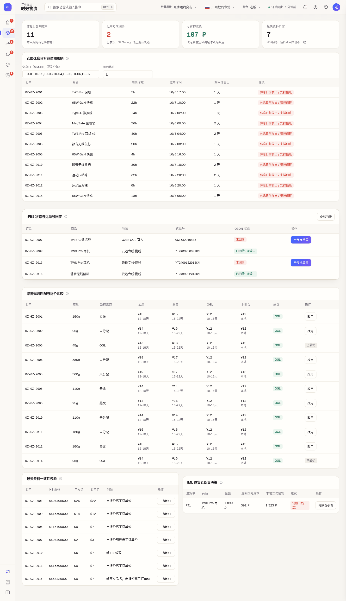

- **页面用途**：围绕 rFBS 截单时效：休息日影响、运单号回传、渠道运价比较、报关一致性、IML 退货仓处置。
- **入口路径**：侧栏「订单履约 → 时效物流」（角标为未回传运单数）。
- **页面区域说明**
  - **KPI**：休息日影响截单（截单期内有仓库休息日）/ 运单号未回传（已发货但 Ozon 后台无轨迹）/ 可省物流费 ₽（改走最便宜且满足时效的渠道）/ 报关资料异常（HS 编码、品名或申报价不一致）。
  - **仓库休息日对截单期影响**：输入框「休息日（MM-DD，逗号分隔）」「每周休息」；表格 订单 / 商品 / 剩余时效 / 截单时间 / 期间休息日 / 建议（休息日前发出 / 安排值班）。ⓘ 提醒在 Ozon 后台同步仓库日程。
  - **rFBS 状态与运单号回传**：「全部回传」；列 订单 / 商品 / 物流 / 运单号 / Ozon 状态（未回传、已回传 · 运输中）/ 操作「回传运单号」。
  - **渠道规则匹配与运价比较**：订单 / 重量 / 当前渠道 / 云途 / 燕文 / OGL / 本地仓（运费与时效）/ 建议 / 操作「改用」。运费 = 每公斤单价 × 重量 + 挂号费 ¥12。
  - **报关资料一致性校验**：订单 / HS 编码 / 申报价 / 订单价 / 问题 / 「一键修正」（按订单价 80% 校准、补 HS 编码与英文品名）。
  - **IML 退货仓处置决策**：退货单 / 商品 / 金额 / 退回国内成本 / 本地二次销售 / 建议 / 「按建议处置」。
- **数据来源**：订单与运单【连接器】；休息日、运价、报关校验【本地计算】；运单号回传【待接 API】（`/v2/fbs/posting/tracking-number/set`），当前需在卖家后台手动填写。
- **适用角色**：老板、运营、仓管。
- **关联页面**：订单履约、店铺健康、退货异常、物流与库存。

## 7. 物流与库存（logistics）

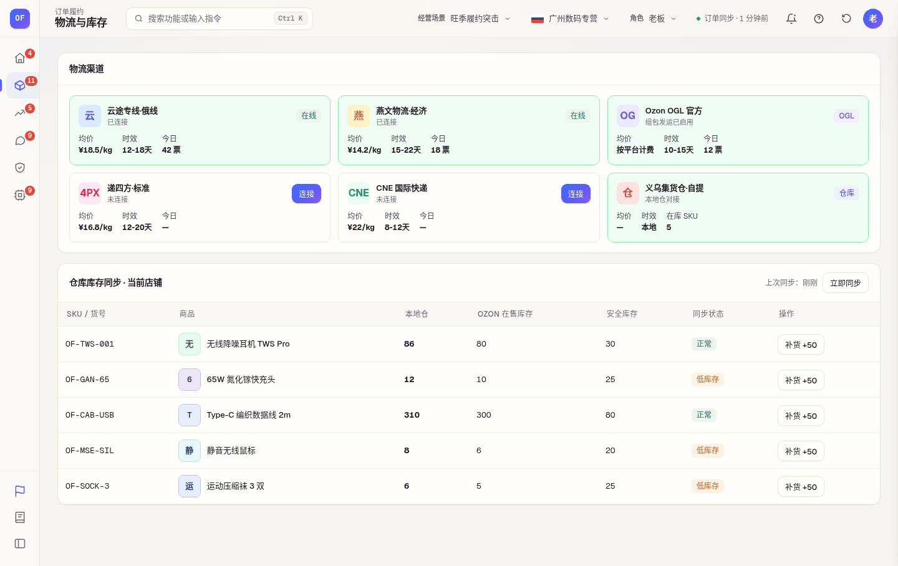

- **页面用途**：管理物流渠道连接与本地仓 ↔ Ozon 在售库存同步、补货。
- **入口路径**：侧栏「订单履约 → 物流与库存」。
- **页面区域说明**
  - **物流渠道**：卡片 云途专线·俄线 / 燕文物流·经济 / Ozon OGL 官方 / 递四方·标准 / CNE 国际快递 / 义乌集货仓·自提；每张显示连接状态、均价（¥/kg 或按平台计费）、时效、今日票数；未连接的有「连接」按钮。
  - **仓库库存同步 · 当前店铺**：「上次同步：…」「立即同步」；列 SKU / 货号 / 商品 / 本地仓 / Ozon 在售库存 / 安全库存 / 同步状态（正常、低库存）/ 操作「补货 +50」。
- **数据来源**：库存与商品【连接器】；渠道参数与低库存判断【本地计算】；库存回写【待接 API】（`/v2/products/stocks`），物流商面单接口需各物流商账号【待接 API】。
- **适用角色**：老板、运营、仓管。
- **关联页面**：订单履约、供应链库存、自动化规则、开店向导（默认物流）。

## 8. 供应链库存（supply）

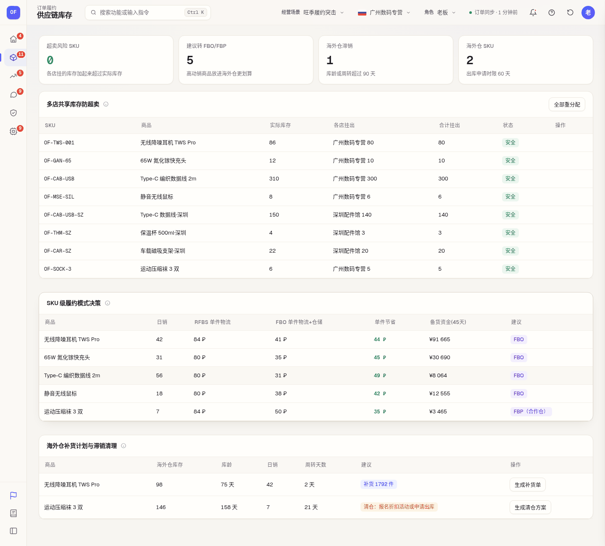

- **页面用途**：多店共享库存防超卖、SKU 级 rFBS / FBO / FBP 决策、海外仓补货与滞销清理。
- **入口路径**：侧栏「订单履约 → 供应链库存」。
- **页面区域说明**
  - **KPI**：超卖风险 SKU / 建议转 FBO/FBP / 海外仓滞销（库龄或周转 > 90 天）/ 海外仓 SKU（出库申请时限 60 天）。
  - **多店共享库存防超卖**：「全部重分配」；列 SKU / 商品 / 实际库存 / 各店挂出 / 合计挂出 / 状态 / 操作。按近 7 天销量比例分配并预留 10%。
  - **SKU 级履约模式决策**：商品 / 日销 / rFBS 单件物流 / FBO 单件物流 + 仓储 / 单件节省 / 备货资金（45 天）/ 建议（FBO、FBP 合作仓、rFBS）。
  - **海外仓补货计划与滞销清理**：商品 / 海外仓库存 / 库龄 / 日销 / 周转天数 / 建议 / 操作「生成补货单」（金额 ≥ ¥1000 进审批）、「生成清仓方案」。
- **数据来源**：库存、销量【连接器】；分配与决策【本地计算】；海外仓出库申请【待接 API】。
- **适用角色**：老板、运营、仓管。
- **关联页面**：物流与库存、审批中心、推广活动（清仓报名）。

## 9. 自动化规则（rules）

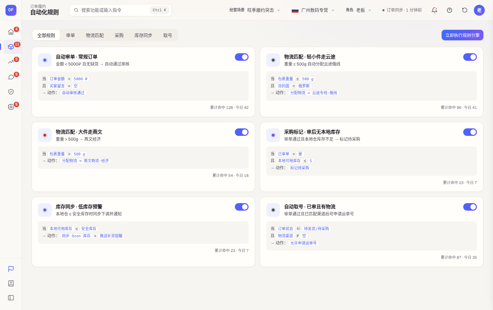

- **页面用途**：配置并执行 IF / THEN 履约规则。
- **入口路径**：侧栏「订单履约 → 自动化规则」。
- **页面区域说明**
  - **类型签**：全部规则 / 审单 / 物流匹配 / 采购 / 库存同步 / 取号；「立即执行规则引擎」（对未发货订单执行全部启用规则，并检查低库存）。
  - **规则卡（6 张）**：名称、描述、条件（当 … 且 … → 动作）、右上角启停开关、「累计命中 N · 今日 N」。
    1. 自动审单 · 常规订单：金额 < 5000₽ 且买家留言为空 → 自动审核通过；
    2. 物流匹配 · 轻小件走云途：重量 ≤ 500g → 云途俄线；
    3. 物流匹配 · 大件走燕文：重量 > 500g → 燕文经济；
    4. 采购标记 · 审后无本地库存：本地仓库存不足 → 待采购；
    5. 库存同步 · 低库存预警：本地仓 ≤ 安全库存 → 同步下调并通知；
    6. 自动取号 · 已审且有物流：审单通过且已匹配渠道 → 可申请运单号。
- **数据来源**：规则定义与执行【本地计算】。
- **适用角色**：老板、运营（可启停与执行）。
- **关联页面**：订单履约、物流与库存、自动化 Agent。

---

# 三、商品增长

## 10. 智能选品（selection）

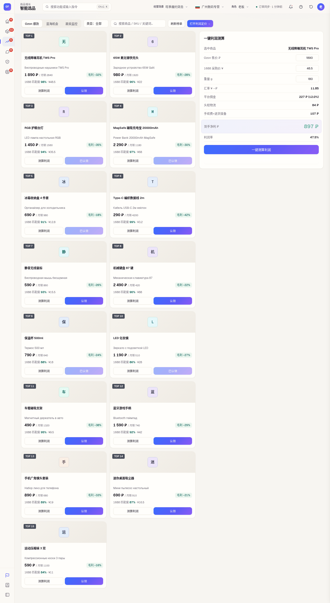

- **页面用途**：浏览爆款 / 蓝海 / 跟卖机会，一键测算利润并认领进刊登。
- **入口路径**：侧栏「商品增长 → 智能选品」；总览「查看选品 →」。
- **页面区域说明**
  - **筛选栏**：页签 Ozon 爆款 / 蓝海机会 / 跟卖监控；类目下拉（全部、电子配件、家居收纳、美容个护、厨房小电）；搜索（商品 / SKU / 关键词）；「刷新榜单」；「打开利润定价 →」。
  - **商品卡网格**：TOP 排名、缩略图、中文名、俄文名、售价 ₽ / 月销、指标；按钮「测算利润」（载入右侧面板）、「认领」（加入刊登草稿，已认领则置灰）。
  - **一键利润测算面板**：选中商品 / Ozon 售价 ₽ / 1688 采购价 ¥ / 重量 g（可编辑）/ 汇率 ¥→₽ / 平台佣金 / 头程物流 / 手续费 + 退货拨备 / 到手净利 ₽ / 利润率；「一键测算利润」「认领到刊登草稿」。
- **数据来源**：榜单为业务数据集，可配合扩展采集的 Ozon / WB 同款价格【公开接口】；利润【本地计算】。
- **适用角色**：老板、运营。
- **关联页面**：利润定价、刊登上架、市场选品、自动化 Agent（选品雷达）。

## 11. 市场选品（market）

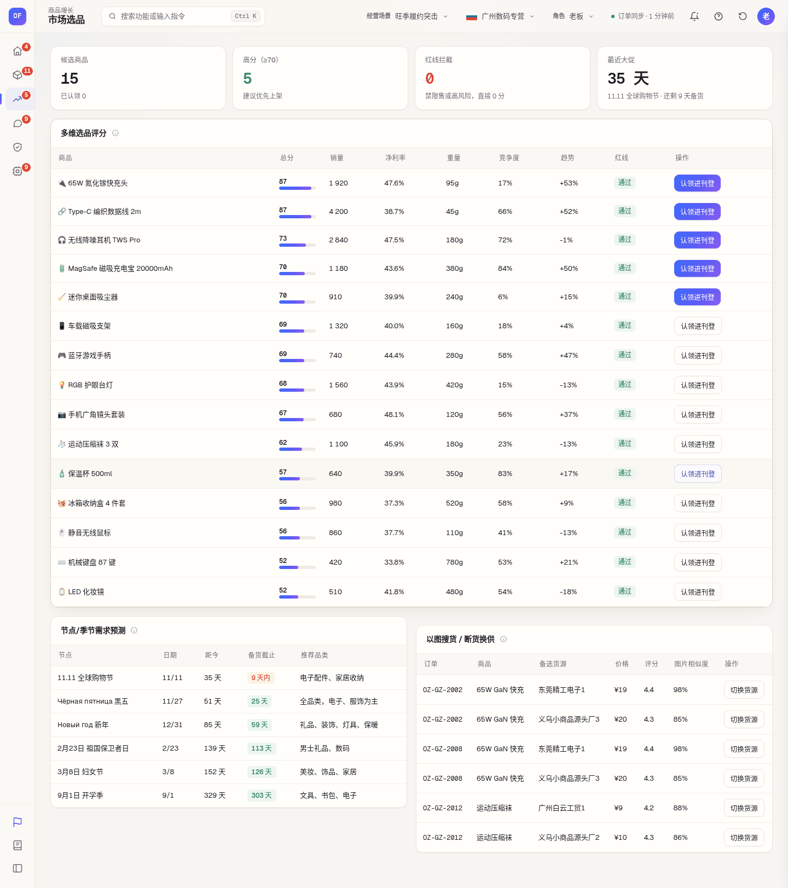

- **页面用途**：公开权重的多维选品评分、节点备货倒推、断货换供。
- **入口路径**：侧栏「商品增长 → 市场选品」。
- **页面区域说明**
  - **KPI**：候选商品（已认领 N）/ 高分（≥70，建议优先上架）/ 红线拦截（禁限售或高风险直接 0 分）/ 最近大促（如 11.11，还剩 N 天备货）。
  - **多维选品评分**：商品 / 总分 / 销量 / 净利率 / 重量 / 竞争度 / 趋势 / 红线 / 「认领进刊登」。权重：销量 25 · 净利率 30 · 重量 10 · 竞争度 15 · 趋势 20。
  - **节点 / 季节需求预测**：节点 / 日期 / 距今 / 备货截止（节点 − 26 天）/ 推荐品类。
  - **以图搜货 / 断货换供**：订单 / 商品 / 备选货源 / 价格 / 评分 / 图片相似度 / 「切换货源」。
- **数据来源**：评分与倒推【本地计算】；1688 货源搜索与下单【待接 API】（1688 开放平台授权），当前可在数据连接页跳转 1688 拍立淘。
- **适用角色**：老板、运营。
- **关联页面**：智能选品、刊登上架、数据连接（以图搜货）、价格竞争。

## 12. 刊登上架（listing）

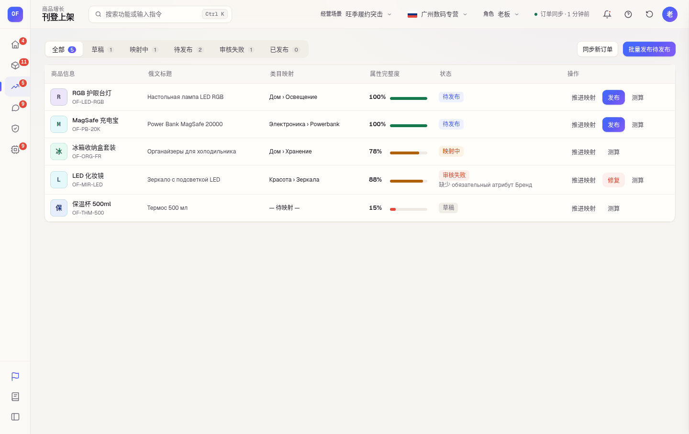

- **页面用途**：把认领商品从草稿推进到映射、待发布、已发布。
- **入口路径**：侧栏「商品增长 → 刊登上架」（角标为待处理数）；认领后自动跳转。
- **页面区域说明**
  - **状态签**：全部 / 草稿 / 映射中 / 待发布 / 审核失败 / 已发布（带数量）。
  - **按钮**：「同步新订单」（为已发布商品生成 2 笔新订单并跳到订单履约）；「批量发布待发布」。
  - **表格列**：商品信息 / 俄文标题 / 类目映射（如 Электроника › Наушники）/ 属性完整度（进度条 %）/ 状态 / 操作（推进映射、修复、发布、测算）。
- **数据来源**：草稿与映射【本地计算】；类目必填属性与商品卡创建【待接 API】（`/v1/description-category/attribute`、`/v3/product/import`），当前需在卖家后台上架。
- **适用角色**：老板、运营。
- **关联页面**：智能选品、市场选品、内容合规、利润定价、开店向导。

## 13. 素材工坊（studio）

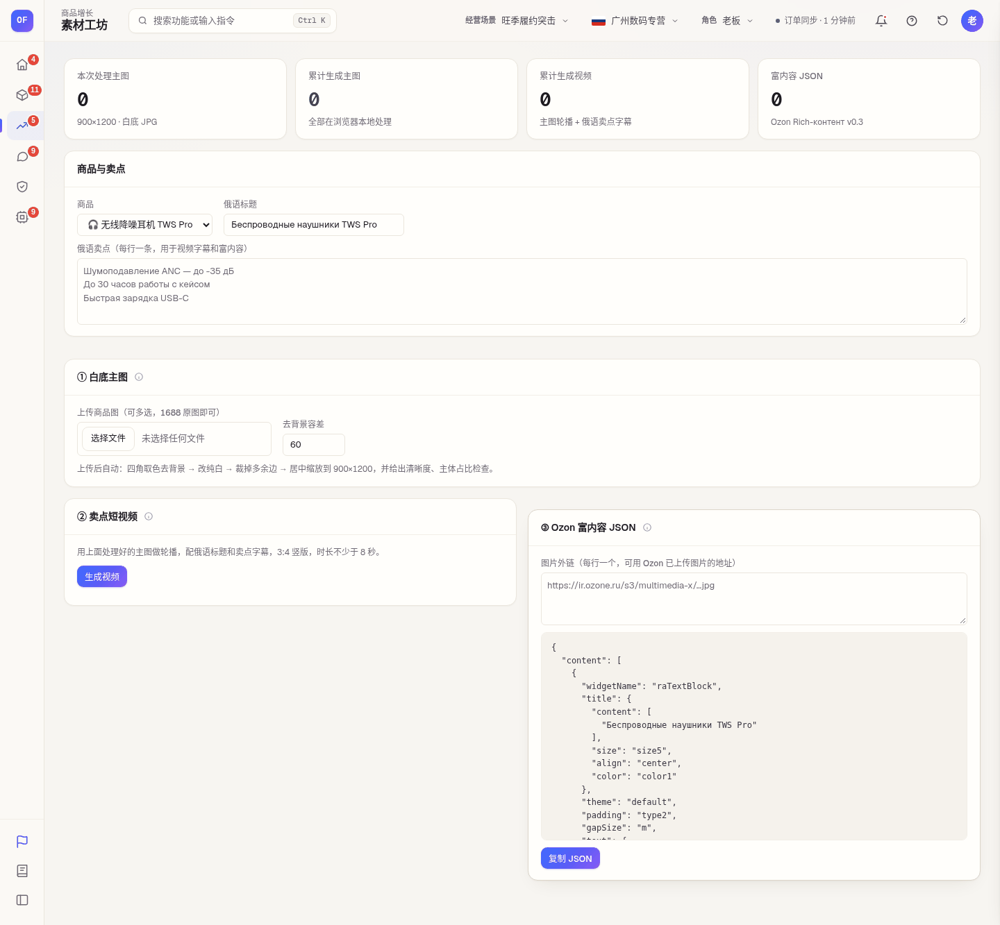

- **页面用途**：在浏览器本地生成白底主图、卖点短视频和 Ozon 富内容 JSON。
- **入口路径**：侧栏「商品增长 → 素材工坊」。
- **页面区域说明**
  - **KPI**：本次处理主图（900×1200 白底 JPG）/ 累计生成主图 / 累计生成视频（主图轮播 + 俄语卖点字幕）/ 富内容 JSON（Rich-контент v0.3）。
  - **商品与卖点**：商品下拉、俄语标题、卖点（每行一条）、图片地址。
  - **① 白底主图**：选择图片文件、背景容差；生成 900×1200 白底 JPG 可下载。
  - **② 卖点短视频**：「生成视频」（新版 Chrome / Edge 输出 MP4，否则 WebM）。
  - **③ Ozon 富内容 JSON**：raTextBlock + raShowcase 结构预览；「复制 JSON」。
- **数据来源**：全部在浏览器本地处理【本地计算】；上传到 Ozon 商品卡需人工或【待接 API】。
- **适用角色**：老板、运营。
- **关联页面**：内容合规、刊登上架。

## 14. 内容合规（content）

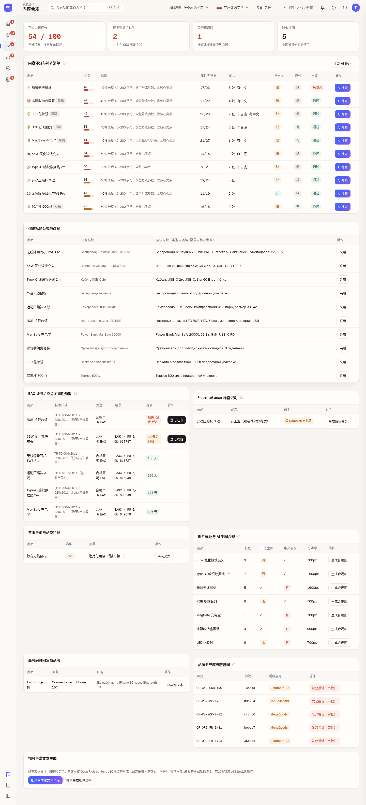

- **页面用途**：内容评分与补齐、俄语标题改写、EAC 证书、Честный знак、禁限售词、图片规范、问答回写、防盗图。
- **入口路径**：侧栏「商品增长 → 内容合规」（角标为证书 + 风险词数）。
- **页面区域说明**
  - **KPI**：平均内容评分（/100）/ 证书到期或缺失 / 禁限售风险 / 疑似盗图。
  - **内容评分与补齐清单**：商品 / 评分 / 标题 / 属性完整度 / 图片 / 富文本 / 视频 / 合规 / 「AI 补齐」；「全部 AI 补齐」。评分维度：俄语标题 25、类目属性 25、图片 20、富文本 10、视频 10、合规 10。
  - **俄语标题公式与改写**：商品 / 当前标题 / 建议标题（类型 + 品牌 / 型号 + 核心参数）/ 「采用」。
  - **EAC 证书 / 豁免函到期预警**：商品 / 技术法规 / 类型 / 编号 / 剩余天数 / 「登记证书」「登记续期」（提前 60 天提醒，缺失或过期的会被刊登 Agent 拦截）。
  - **Честный знак 标签识别**：商品 / 品类 / 要求 / 「生成贴标任务」。
  - **禁限售词与品类拦截**：商品 / 命中 / 原因 / 「清洗文案」。
  - **图片规范与 AI 生图合规**：商品 / 张数 / 白底主图 / 中文字样 / 分辨率 / 「生成合规图」（≥5 张、主图白底、无中文和水印、边长 ≥900px）。
  - **高频问答回写商品卡**：商品 / 问题 / 回答 / 「回写到描述」。
  - **品牌资产库与防盗图**：图片 / 指纹 / 疑似盗用 / 「发起投诉（审批）」。
  - **视频与富文本生成**：「批量生成富文本草稿」「批量生成视频脚本」。
- **数据来源**：商品内容【连接器】；评分、风险词、证书预警【本地计算】；同步到商品卡【待接 API】。
- **适用角色**：老板、运营。
- **关联页面**：刊登上架、素材工坊、审批中心、客服评价（问答）。

## 15. 价格竞争（compete）

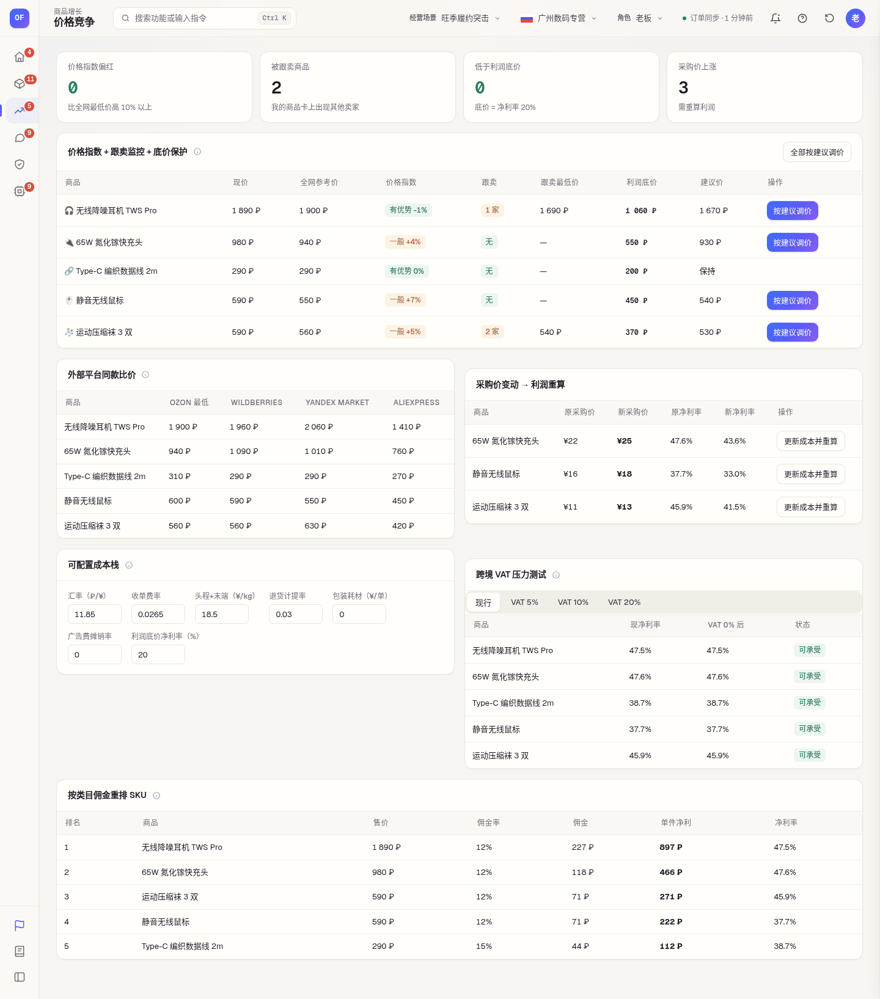

- **页面用途**：价格指数、跟卖监控、底价保护、外部比价、成本栈、采购价变动重算、VAT 压力测试、佣金重排。
- **入口路径**：侧栏「商品增长 → 价格竞争」（角标为价格指数偏红数）。
- **页面区域说明**
  - **KPI**：价格指数偏红（比全网最低高 10% 以上）/ 被跟卖商品 / 低于利润底价（底价 = 净利率 20%）/ 采购价上涨。
  - **价格指数 + 跟卖监控 + 底价保护**：商品 / 现价 / 全网参考价 / 价格指数 / 跟卖 / 跟卖最低价 / 利润底价 / 建议价 / 「按建议调价」；「全部按建议调价」。调价不低于底价，幅度 > 10% 进审批。
  - **外部平台同款比价**：商品 / Ozon 最低 / Wildberries / Yandex Market / AliExpress。
  - **采购价变动 → 利润重算**：商品 / 原采购价 / 新采购价 / 原净利率 / 新净利率 / 「更新成本并重算」。
  - **可配置成本栈**：利润底价（净利率 %）、头程 ¥/kg、退货拨备、支付手续费、包材 ¥、汇率、广告占比，改一处全系统同步。
  - **跨境 VAT 压力测试**：页签 现行 / VAT 5% / 10% / 20%；商品 / 现净利率 / VAT 后 / 状态。
  - **按类目佣金重排 SKU**：排名 / 商品 / 售价 / 佣金率 / 佣金 / 单件净利 / 净利率。
- **数据来源**：同款价格【公开接口】（扩展采集 Ozon / WB）；其他平台比价需比价数据服务【待接 API】；改价写回【待接 API】（`/v1/product/import/prices`，审批后执行）；计算【本地计算】。
- **适用角色**：老板、运营、财务。
- **关联页面**：利润定价、审批中心、数据连接、推广活动。

## 16. 推广活动（promo）

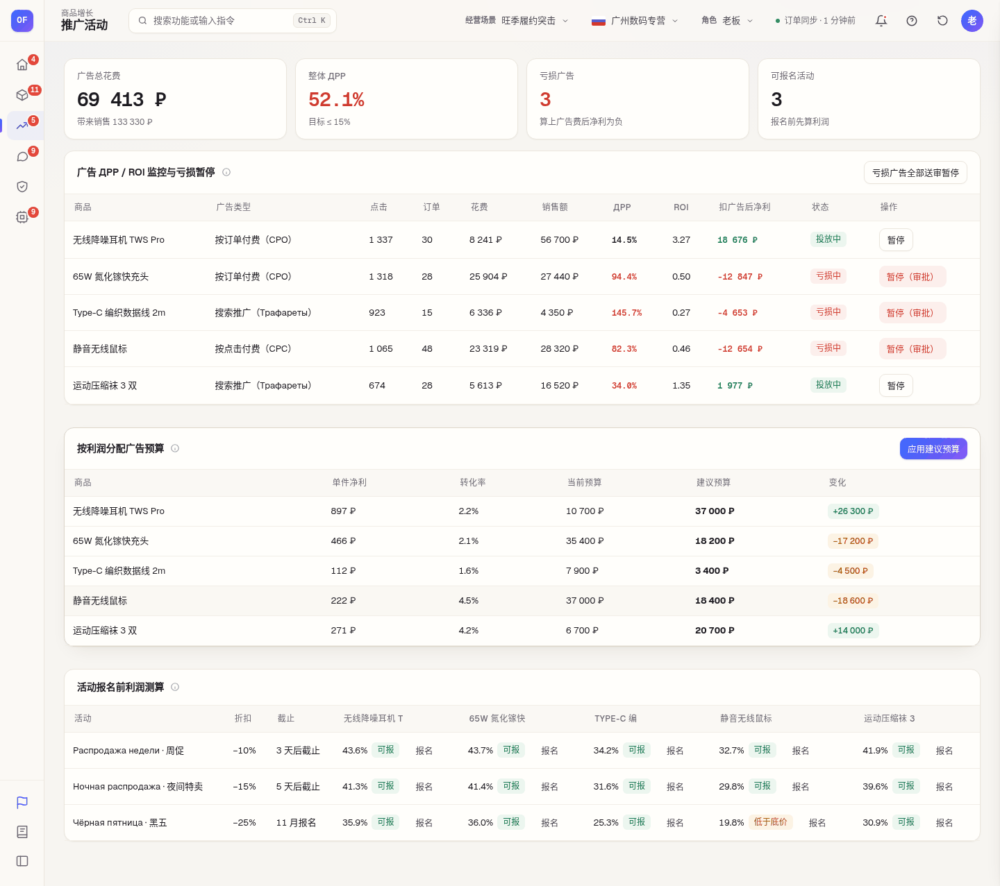

- **页面用途**：广告 ДРР / ROI 监控、亏损送审暂停、按利润分预算、活动报名前利润测算。
- **入口路径**：侧栏「商品增长 → 推广活动」（角标为亏损广告数）。
- **页面区域说明**
  - **KPI**：广告总花费（带来销售 N ₽）/ 整体 ДРР（目标 ≤ 15%）/ 亏损广告 / 可报名活动。
  - **广告 ДРР / ROI 监控与亏损暂停**：商品 / 广告类型 / 点击 / 订单 / 花费 / 销售额 / ДРР / ROI / 扣广告后净利 / 状态 / 操作（暂停、暂停（审批）、恢复）；「亏损广告全部送审暂停」。
  - **按利润分配广告预算**：商品 / 单件净利 / 转化率 / 当前预算 / 建议预算 / 变化；「应用建议预算」。
  - **活动报名前利润测算**：活动 / 折扣 / 截止 / 各商品参加活动后的净利率 / 「报名」（低于底价进审批）。
- **数据来源**：广告数据需 Ozon Performance API（client_id + client_secret）【待接 API】；活动列表 `/v1/actions`【待接 API】；利润测算【本地计算】。
- **适用角色**：老板、运营、财务。
- **关联页面**：价格竞争、审批中心、利润定价、供应链库存（清仓）。

---

# 四、客服售后

## 17. 客服评价（cs）

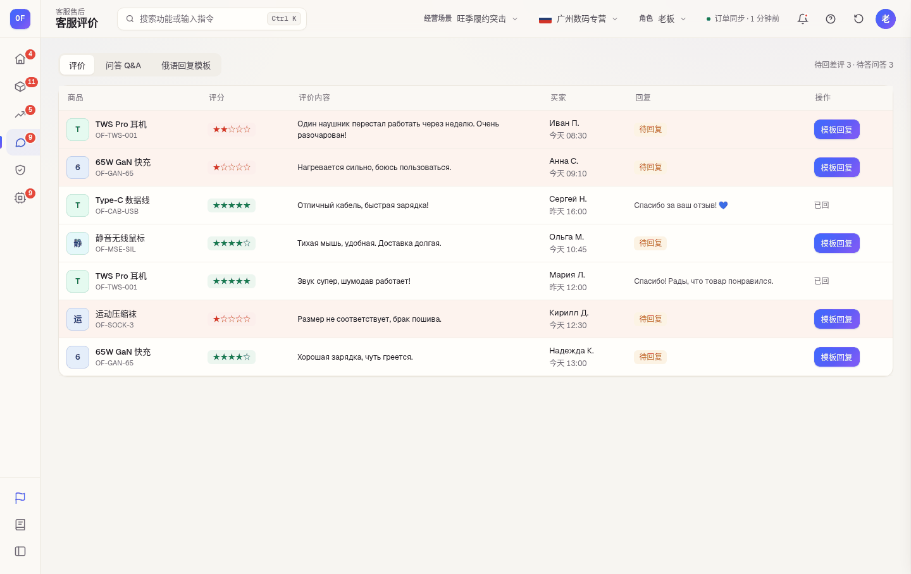

- **页面用途**：处理评价、问答，管理俄语回复模板。
- **入口路径**：侧栏「客服售后 → 客服评价」（角标为待回数）；三级菜单 评价 / 问答 / 回复模板。
- **页面区域说明**
  - **页签**：评价 / 问答 Q&A / 俄语回复模板；右侧提示「待回差评 N · 待答问答 N」。
  - **评价表**：商品 / 评分（星级，≤3 星为差评）/ 评价内容 / 买家 / 回复 / 操作「模板回复」。
  - **问答表**：商品 / 问题 / 回答 / 状态 / 操作「回答」。
  - **回复模板**：差评致歉·质量、物流延误说明、好评感谢、尺码 / 参数答疑、退货指引；每张显示中文名与俄语正文，按钮「复制」。
- **数据来源**：评价与问答【连接器】；回复发送【待接 API】（`/v1/review/comment/create`、`/v1/question/answer/create`，需 Premium Plus 订阅），当前需在卖家后台粘贴发送。
- **适用角色**：老板、运营、客服。
- **关联页面**：客服收件箱、退货异常、内容合规（问答回写）、自动化 Agent（俄语客服、差评预警升级）。

## 18. 客服收件箱（inbox）

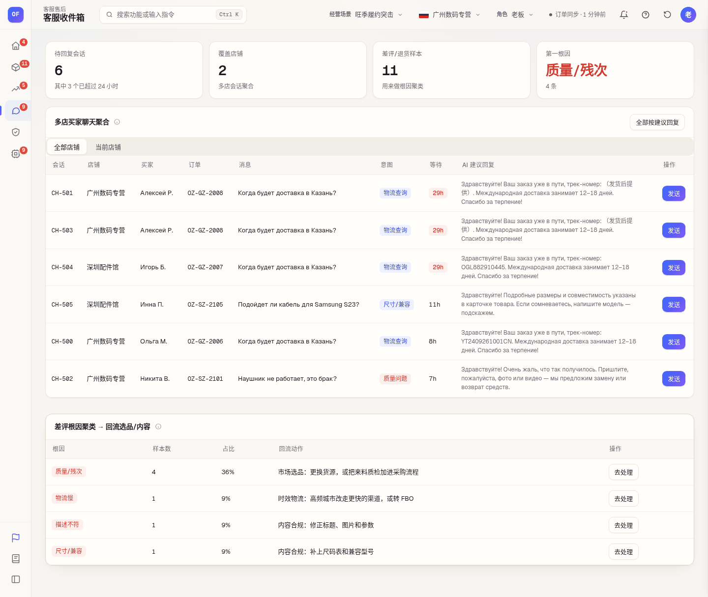

- **页面用途**：多店买家聊天聚合与俄语意图回复，差评根因聚类回流。
- **入口路径**：侧栏「客服售后 → 客服收件箱」（角标为未回复会话数）。
- **页面区域说明**
  - **KPI**：待回复会话（其中超 24 小时 N）/ 覆盖店铺 / 差评 / 退货样本 / 第一根因。
  - **多店买家聊天聚合**：页签 全部店铺 / 当前店铺；「全部按建议回复」；列 会话 / 店铺 / 买家 / 订单 / 消息 / 意图 / 等待 / AI 建议回复 / 「发送」。
  - **差评根因聚类 → 回流选品 / 内容**：根因 / 样本数 / 占比 / 回流动作 / 「去处理」（跳内容合规、时效物流、市场选品等）。
- **数据来源**：聊天需 `/v3/chat/list`、`/v1/chat/send/message`（Premium Plus）【待接 API】；意图识别与聚类【本地计算】。
- **适用角色**：老板、运营、客服。
- **关联页面**：客服评价、退货异常、内容合规、时效物流、市场选品。

## 19. 退货异常（returns）

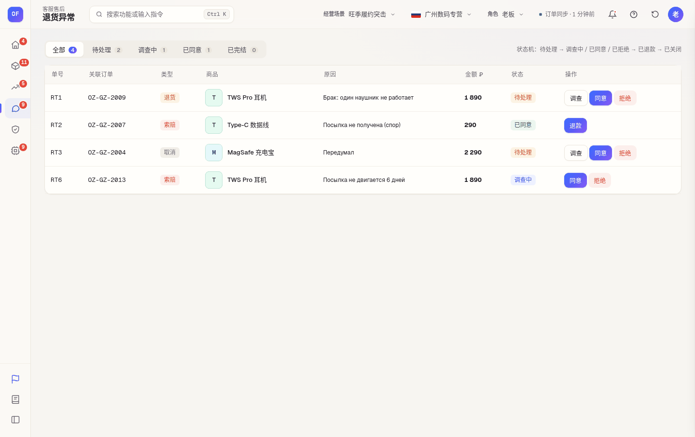

- **页面用途**：取消 / 退货 / 索赔按状态机处理。
- **入口路径**：侧栏「客服售后 → 退货异常」（角标为待处理数）；三级菜单 待处理 / 调查中 / 已同意。
- **页面区域说明**
  - **筛选签**：全部 / 待处理 / 调查中 / 已同意 / 已完结；状态机说明「待处理 → 调查中 / 已同意 / 已拒绝 → 已退款 → 已关闭」。
  - **表格列**：单号 / 关联订单 / 类型（退货、索赔、取消）/ 商品 / 原因（俄语原文）/ 金额 ₽ / 状态 / 操作（调查、同意、拒绝、退款，按状态显示）。退款 ≥ 2000₽ 进入审批中心。
- **数据来源**：退货单【连接器】；状态推进【本地计算】；退货列表接口 `/v1/returns/list`【待接 API】，退款决定需在卖家后台处理。
- **适用角色**：老板、仓管、客服（运营、财务可经 Agent 处理）。
- **关联页面**：审批中心、订单履约、客服评价、时效物流（IML 处置）、财务对账。

---

# 五、财务风控

## 20. 利润定价（profit）

- **页面用途**：维护共享费率，按日常价 / 跟卖价 / 活动价三情景测算净利。
- **入口路径**：侧栏「财务风控 → 利润定价」；智能选品「打开利润定价 →」；刊登「测算」。
- **页面区域说明**
  - **共享费率（单位经济）**：汇率 ¥→₽、头程 ¥/kg、支付手续费、退货拨备；佣金阶梯（≤500₽ 15% / 500–2000₽ 12% / >2000₽ 10%）；「保存费率」。
  - **选品 / 在售 · 快速测算**：商品 / 售价 ₽ / 成本 ¥ / 「测算利润」。
  - **情景对比 · 跟卖价 / 活动价**：日常价（当前售价）、跟卖价（× 95%）、活动价（× 90%）三张卡：售价、佣金率与金额、头程、手续费 + 拨备、净利、利润率（亏损标红）。
  - **自定义测算**：售价 ₽、采购价 ¥、重量 g；「重新测算三情景」。
- **数据来源**：【本地计算】（净利 = 售价 − 采购成本 × 汇率 − 佣金 − 头程 − 手续费 − 退货拨备 − 包材 − 广告）。
- **适用角色**：老板、运营、财务。
- **关联页面**：智能选品、刊登上架、价格竞争、财务对账、自动化 Agent（利润守门、汇率佣金重算）。

## 21. 财务对账（finance）

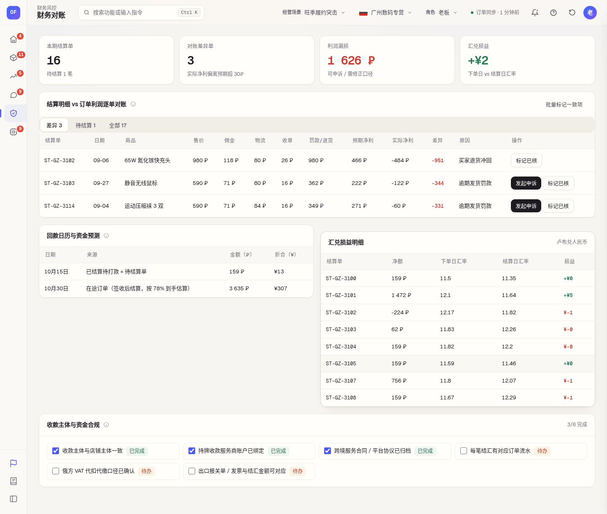

- **页面用途**：结算明细 vs 订单利润逐单对账、争议申诉、回款日历、汇兑损益、收款合规自查。
- **入口路径**：侧栏「财务风控 → 财务对账」（角标为差异单数）。
- **页面区域说明**
  - **KPI**：本期结算单（待结算 N）/ 对账差异单（实际净利偏离预期超 30₽）/ 利润漏损 ₽ / 汇兑损益 ¥。
  - **结算明细 vs 订单利润逐单对账**：页签 差异 / 待结算 / 全部；「批量标记一致项」；列 结算单 / 日期 / 商品 / 售价 / 佣金 / 物流 / 收单 / 罚款 / 退货 / 预期净利 / 实际净利 / 差异 / 原因 / 操作（标记已核、发起申诉）。
  - **回款日历与资金预测**：日期 / 来源 / 金额 ₽ / 折合 ¥（每月 15 日与月末两次回款估算）。
  - **汇兑损益明细**：结算单 / 净额 / 下单日汇率 / 结算日汇率 / 损益。
  - **收款主体与资金合规**：6 项勾选清单（收款主体与店铺主体一致、持牌收款服务商账户、跨境服务合同归档、结汇对应订单流水、VAT 代扣代缴口径、报关单 / 发票与结汇金额对应），显示完成数。
- **数据来源**：结算【连接器】（扩展捕获财务页或导入财务报表）；对账与汇兑【本地计算】；新财务接口 `/v1/finance/accrual/*`、回款流水【待接 API】。
- **适用角色**：老板、财务。
- **关联页面**：数据连接、利润定价、审批中心（申诉）、店铺健康（罚款）。

## 22. 店铺健康（health）

- **页面用途**：服务质量指标、错误指数分档与罚金估算、封店风险分、临期抢救、多账号与商品卡合并违规。
- **入口路径**：侧栏「财务风控 → 店铺健康」（角标「!」表示有罚金或风险分 ≥ 60）。
- **页面区域说明**
  - **KPI**：错误指数（%，分档，2026-09-22 起重新计算）/ 本期罚金估算 ₽（降到 5% 以下需少出错 N 单）/ 封店风险分（/100）/ 店铺评分（差评占比 · 退货率）。
  - **服务质量指标**：「一键抢救临期订单」；列 指标（卖家原因取消率、逾期发货率、渠道 / 运单错误率）/ 统计窗口 / 当前 / 平台阈值 / 占用 / 状态。
  - **错误指数趋势（近 8 周）**：柱图；ⓘ 中可调罚金单价（₽ / 单）。分档：≤5% 正常 · 5.1–10% 一档 · >10% 二档。
  - **风险分构成**：维度（取消率 30、逾期发货 25、错误指数 20、差评占比 15、退货率 10）/ 权重 / 当前。风险分 ≥ 60 时申诉、下架、批量改价强制审批。
  - **临期订单抢救清单**：订单 / 商品 / 状态 / 剩余时效 / 建议；「申诉误判错误」。
  - **同主体多账号结构**：同一执照最多 6 家店，提示跨店重复铺货。
  - **商品卡合并违规**：SKU / 商品 / 问题 / 「生成整改任务」。
- **数据来源**：订单与评价【连接器】；指标与风险分【本地计算】（阈值来自平台规则知识库）。
- **适用角色**：老板、运营、财务。
- **关联页面**：订单履约、时效物流、审批中心、平台集成（规则知识库）。

---

# 六、自动化与集成

## 23. 自动化 Agent（agents）

- **页面用途**：13 个跨境 rFBS 垂直 Agent 的开关、立即运行、定时回合、一键级联与活动日志。
- **入口路径**：侧栏「自动化与集成 → 自动化 Agent」（角标为启用数）。
- **页面区域说明**
  - **标题栏**：「自动化 Agent Hub」+ 场景 · 启用数 · 今日已处理；「执行定时回合」（运行已启用的 Agent）；「一键跑全部 Agent」。
  - **概览条**：启用中 / 今日处理 / 专业 Agent（13）。
  - **Agent 卡片（13 张）**：名称、职责、启停开关、「上次：…」「今日 N」、「运行」（手动运行，停用也可）、「查看模块 →」、活动日志。13 个 Agent 与职责：
    | Agent | 职责 | 关联页面 |
    |---|---|---|
    | 选品雷达 | 扫描爆款榜，按毛利阈值（25%）认领进刊登草稿 | 智能选品 |
    | 刊登过审 | 推进类目映射完整度，就绪后发布 | 刊登上架 |
    | 审单履约 | 自动审单 → 匹配物流 → 申请面单 | 订单履约 |
    | 超时抢救 | 优先处理 eta ≤ 6h：审单 → 面单 → 发货，缺货标采购 | 订单履约 |
    | 1688 采购跟单 | 待采购订单下单跟单，回写入库并推进待发货 | 订单履约 |
    | 物流轨迹异常 | 扫描已发货轨迹停滞 / 清关异常，写预警 | 订单履约 |
    | 利润守门 | 拦截 / 标记低于最低毛利的刊登与跟卖价，给建议价 | 利润定价 |
    | 汇率佣金重算 | 按最新汇率与佣金阶梯重算净利，标异常 | 利润定价 |
    | 俄语客服 | 对未回复差评发送俄语致歉模板 | 客服评价 |
    | 差评预警升级 | 1 星差评升级为理赔工单，联动退货 | 客服评价 |
    | 退货理赔 | 推进开放退货单：调查 → 同意 / 拒绝 → 退款关闭 | 退货异常 |
    | 库存补货 | 低于安全库存的 SKU 补货入库 | 物流与库存 |
    | 周报汇报 | 生成经营周报快照并推送摘要 | 经营周报 |
  - **最近活动合流**：所有 Agent 的动作按时间汇总，右上角条数。
- **数据来源**：【本地计算】（页面打开时每 45 秒执行一次已启用 Agent 的定时回合）；高风险动作进入审批中心。
- **适用角色**：老板、运营、仓管、客服（执行受各自权限约束）。
- **关联页面**：经营总览、审批中心，以及上表各业务页面。

## 24. 数据连接（connect）

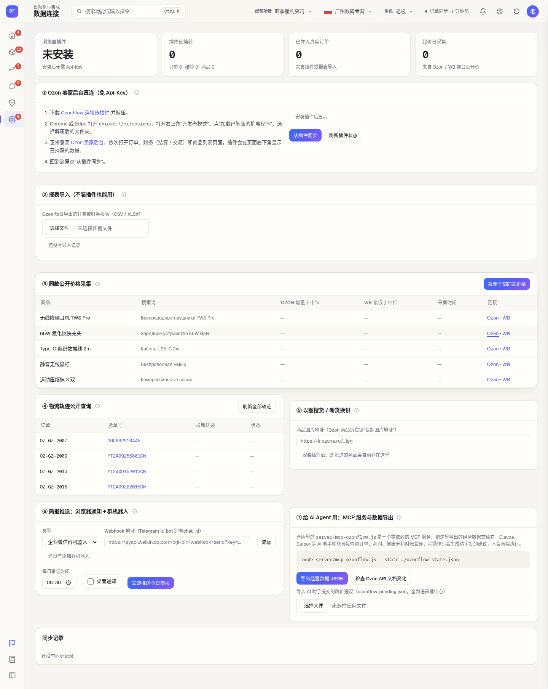

- **页面用途**：免 Api-Key 接入真实店铺数据的总入口。
- **入口路径**：侧栏「自动化与集成 → 数据连接」；命令面板「同步店铺数据」。
- **页面区域说明**
  - **KPI**：浏览器插件（未安装 / 已连接 vX）/ 插件已捕获（订单 · 结算 · 商品）/ 已并入真实订单 / 比价已采集。
  - **① Ozon 卖家后台直连**：4 步安装说明（下载 zip → chrome://extensions 开发者模式加载 → 登录卖家后台浏览订单 / 财务 / 商品 → 从插件同步）；最近捕获表（页面 / 订单 / 结算 / 商品）；「从插件同步」「刷新插件状态」「清空插件缓存」（已安装时）；识别到 Premium 订阅门槛时显示提示。
  - **② 报表导入**：选择 CSV / XLSX；导入记录（时间 / 文件 / 类型 订单·结算·未识别 / 识别行数 / 结果）。
  - **③ 同款公开价格采集**：「采集全部同款价格」；商品 / 搜索词 / Ozon 最低 / 中位 / WB 最低 / 中位 / 采集时间 / 链接。
  - **④ 物流轨迹公开查询**：「刷新全部轨迹」；订单 / 运单号（可点开菜鸟查询页）/ 最新轨迹 / 状态。
  - **⑤ 以图搜货 / 断货换供**：输入商品图片地址后出现「1688 以图搜货」「Яндекс 同款」「Google Lens」「速卖通」跳转；浏览过的商品列表。
  - **⑥ 简报推送**：类型（企业微信 / 钉钉 / 飞书群机器人、Telegram Bot、通用 Webhook）、Webhook 地址、「添加」；每日推送时间、桌面通知、「立即推送今日简报」。
  - **⑦ 给 AI Agent 用：MCP 服务与数据导出**：启动命令；「导出经营数据 JSON」「检查 Ozon API 文档变化」；导入 AI 助手提交的改价建议（ozonflow-pending.json，全部进审批中心）。
  - **同步记录**：时间 / 动作 / 结果。
- **数据来源**：【连接器】【公开接口】；推送使用用户自己配置的群机器人 Webhook。
- **适用角色**：老板、运营、仓管、财务。
- **关联页面**：订单履约、财务对账、价格竞争、平台集成。

## 25. 平台集成（platform）

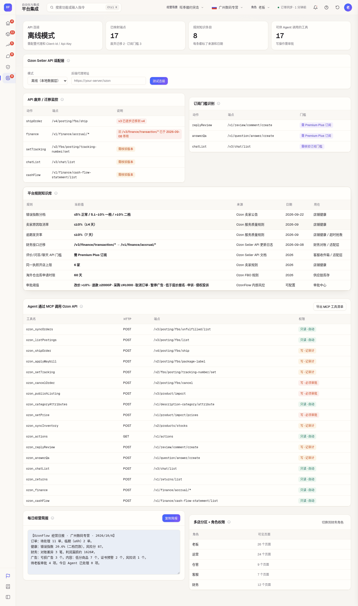

- **页面用途**：Seller API 适配层与代理配置、API 废弃 / 订阅门槛监控、平台规则知识库、MCP 工具导出、每日简报、角色说明。
- **入口路径**：侧栏「自动化与集成 → 平台集成」。
- **页面区域说明**
  - **KPI**：API 连接（离线模式 / 已连接）/ 已映射端点（17，废弃迁移 2 · 订阅门槛 3）/ 规则知识条目（8）/ 可供 Agent 调用的工具（17，写操作需审批）。
  - **Ozon Seller API 适配层**：模式（离线（本地数据层）/ 代理（真实店铺））、后端代理地址、「测试连接」。
  - **API 废弃 / 迁移监控**：动作 / 端点 / 说明（如 shipOrder 迁移到 v4；财务旧接口 2026-09-08 停用）。
  - **订阅门槛识别**：replyReview、answerQa 需 Premium Plus；chatList 需核验。
  - **平台规则知识库**：规则 / 当前值 / 来源 / 日期 / 用在（错误指数分档、取消率、逾期率、财务接口迁移、订阅门槛、开店上限、海外仓时限、审批阈值）。
  - **Agent 通过 MCP 调用 Ozon API**：工具名 / HTTP / 端点 / 权限（只读 · 自动、写 · 记审计、写 · 必须审批）；「导出 MCP 工具清单」。
  - **每日经营简报**：简报文本；「复制简报」。
  - **多店分区 + 角色权限**：角色与可见页面数（老板 26 / 运营 24 / 仓管 9 / 客服 7 / 财务 12）；「切换到财务角色」。
- **数据来源**：端点映射来自 `js/adapters/ozon-seller-api.js`；代理为 `server/ozon-proxy.js`【待接 API】；规则知识库【本地计算】。
- **适用角色**：老板、运营、财务。
- **关联页面**：数据连接、能力矩阵、审批中心、店铺健康。

## 26. 能力矩阵（capability）

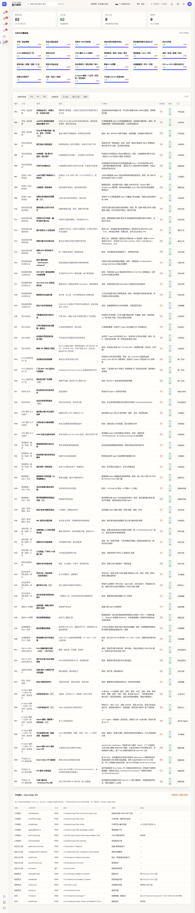

- **页面用途**：62 条需求地图的覆盖度总览，按方向 / 优先级 / 状态筛选并直达对应页面。
- **入口路径**：侧栏「自动化与集成 → 能力矩阵」。
- **页面区域说明**
  - **KPI**：需求总数（62，22 个业务方向）/ 已上线 / 部分上线 / 规划中。
  - **业务方向覆盖度**：22 个方向格子（条数与覆盖率进度条），点击筛选，再点清除。
  - **需求表**：页签 全部优先级 / P0 / P1 / P2，全部状态 / 已上线 / 部分上线 / 规划；列 编号 / 方向 / 需求 / 痛点 / AI 解法 / 优先级 / 状态 / 入口（跳转对应页面）。
  - **平台接入 · Ozon Seller API**：分组 / 业务动作 / 方法 / 端点 / 说明 / 备注（17 个端点）。
- **数据来源**：`js/requirements-data.js`（与 REQUIREMENTS_MAP.md 同源）【本地计算】。
- **适用角色**：老板、运营、财务。
- **关联页面**：全部业务页面。

---

# 附：弹窗与浮层

| 浮层 | 触发 | 说明 |
|---|---|---|
| 新手开店引导 | 首次进入小白冷启动 / 侧栏「开店引导」/ 场景下拉 | 4 步：绑定店铺、选择 rFBS、默认物流、导入商品 |
| 订单详情抽屉 | 订单履约点击行 | 商品、订单信息、自动化轨迹、快捷操作 |
| 命令面板 | 顶栏搜索、Ctrl/⌘K、/ | 页面、三级筛选、常用操作、让 AI 执行 |
| 经营场景 / 店铺 / 角色下拉 | 顶栏 | 切换业务数据集、店铺分区、角色权限 |

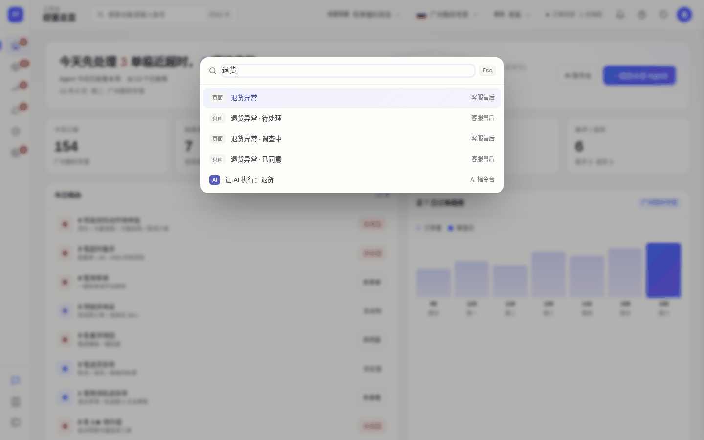
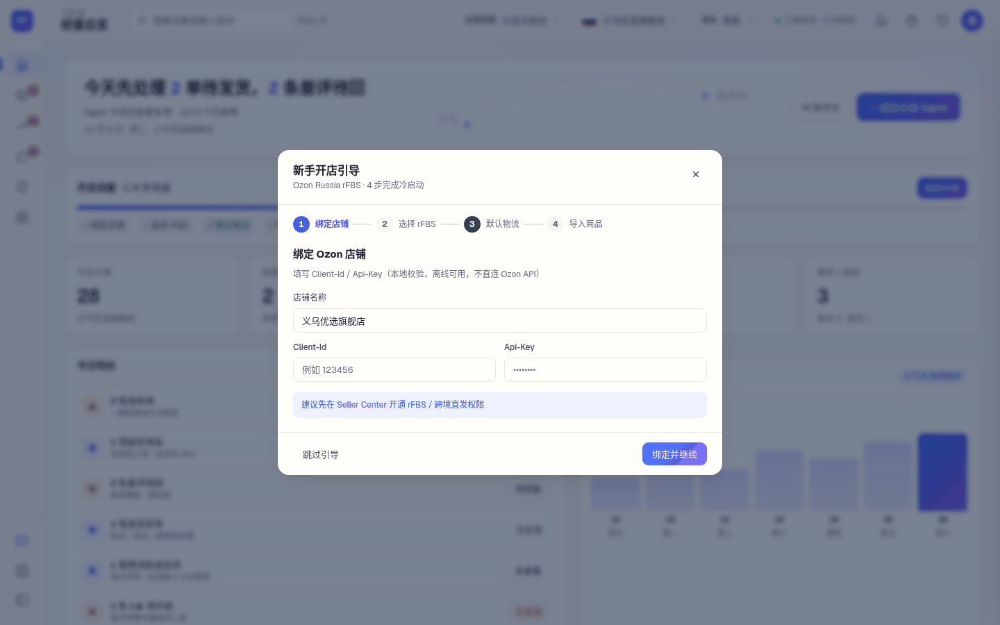
